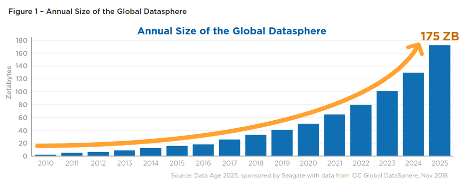
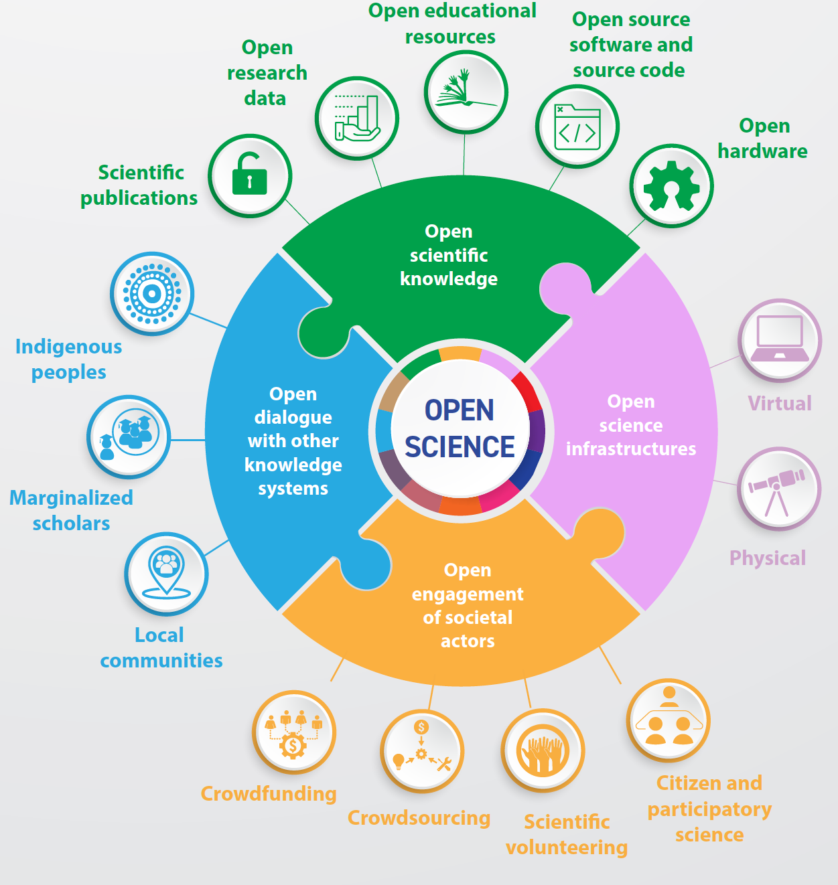
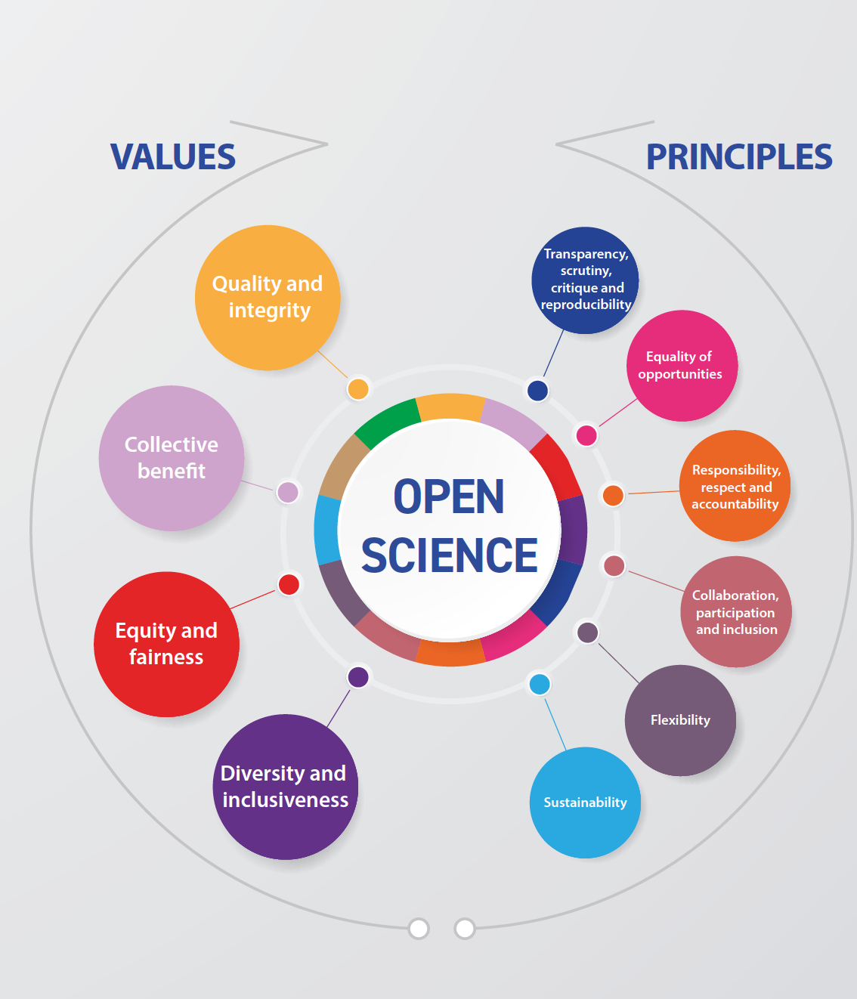
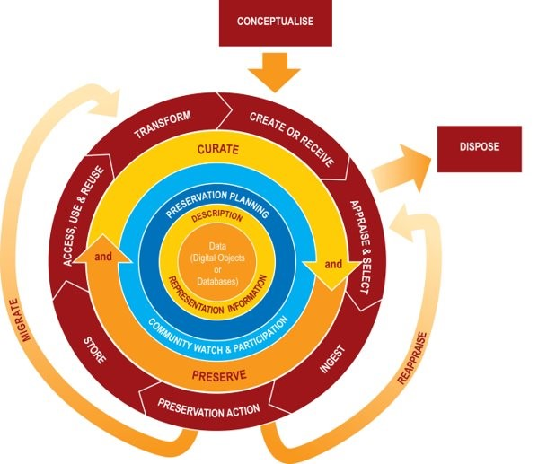
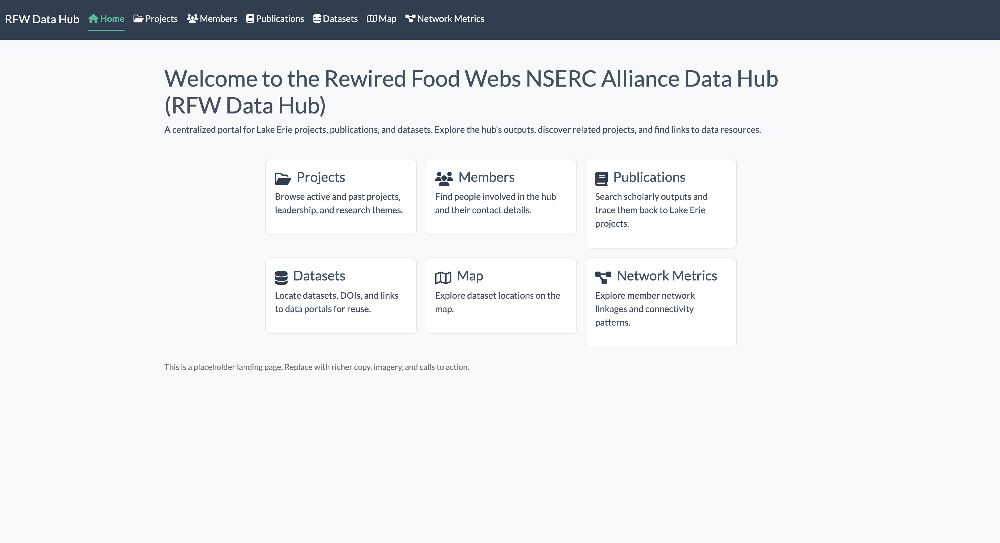

## About us 

::: {style="text-align: center;"}
[{width=80%}](https://insileco.io/){target="_blank"}
:::

## About us 

***inSileco*** & ***ArcticNet*** **(since 2023)**

- Develop criteria for project Data Management
- Review and provide feedback on project Data Management Plans
- Support researchers with RDM practices and tools
- Maintain and expand ArcticNet’s long-term data archive
- Deliver training and capacity building (e.g. this webinar)

## Webinar Structure  

<br>

1. ***Why***
2. ***What***
3. ***When & Who*** 
4. ***How to Guide*** 
5. ***Future*** 
6. ***Q&A*** 


# *Why*

Data & Open Science

## More than papers  

- More than papers ➡️ [Crossref Event Data](https://www.crossref.org/services/event-data/)
- Researchers produce a **diversity of artefacts**
  - 🫙 protocols
  - 💻 code
  - 💾 **datasets** (observations, measurements, etc.)
  - 📢 public debates
- Datasets are 
  - getting bigger 
  - getting more diversified
  - now published standalone  


## What is “data”?  

- Broad definition: **recorded information supporting research findings**  
  - could include various artefacts, e.g., 💻 code
- Data = information in a form that can be processed
  - often this means "structured collection of bits"
  - the structure = format 
  - spreadsheet, images, etc.
- Useful lens: the **5 V’s of Big Data**  
  - **Volume**, **Variety**, Velocity, Veracity, and **Value**  


:::footer 
[IBM website](https://www.ibm.com/think/topics/big-data)
:::


## Data explosion (Volume)

:::: {.columns}

::: {.callout-tip }
### GBIF: Global Biodiversity Information Facility
:::

::: {.column width="60%"}
- New questions & horizons ➡️ more data  
- Powerful technologies enabling unprecedented data collection
- AI exploiting massive data collection 
- Ex: Large Hadron Collider ➡️ ~40 Zettabytes in 2017
- Ex: GBIF
  - 125 million records in 2007 
  - 1.6 billion in 2020
  - **1 150% increase in just 13 years**
:::

::: {.column width="40%"}
[{width=100%}](img/datasphere.png)

[{width=100%}](img/bigData.png)
:::

:::: 

:::footer 
[IDC–Seagate Data Age Whitepaper](https://www.seagate.com/files/www-content/our-story/trends/files/idc-seagate-dataage-whitepaper.pdf) 
&nbsp; ***·*** &nbsp;
[Seagate WP DataAge 2025](https://www.seagate.com/files/www-content/our-story/trends/files/Seagate-WP-DataAge2025-March-2017.pdf)
&nbsp; ***·*** &nbsp;
[Clissa *et al.* 2023. *How big is Big Data?* Frontiers in Big Data](https://www.frontiersin.org/journals/big-data/articles/10.3389/fdata.2023.1271639/full)
&nbsp; ***·*** &nbsp;
[Mason *et al.* 2021. *Data integration enables global biodiversity synthesis* PNAS](https://www.pnas.org/doi/10.1073/pnas.2018093118)
:::


## Data heterogeneity (Variety)

:::: {.columns}

::: {.column width="70%"}
- Different objects, storage formats, technologies  
- Data vary widely across and within disciplines  
- Lack of standards hinders integration and reuse  
- Legacy practices (e.g., local storage) limit access and preservation  
- Prevalent in large Interdisciplinary Research Programs
:::

::: {.column width="30%"}
[{width=100%}](img/variety-of-big-data-sources.png)
:::

:::: 

:::footer
[ColumnFive Media](https://www.columnfivemedia.com/work/infographic-intelligence-by-variety)
:::


## Benefits (Value)

:::: {.columns}

::: {.column width="70%"}
- We need reliable data to better understand and predict
  - anticipate/mitigate future changes
  - Ex: good assessment of temperature and precipitation change
- Some data are hard to collect
  - Arctic Data are good examples
- Data are **precious** for future generations
  - We cannot collect past data
:::

::::


## Why this matters for you

::: {.callout-tip}
### IRP: Interdisciplinary Research Program
:::

- Data is a **primary research output**  
- Reduces risk of **data loss or inaccessibility**  
- Proper management increases **visibility & citations**  
- Strengthens **compliance** with funders & journals  
- Builds a foundation for **collaboration in IRPs**
  - data may be reused in unexpected ways by colleagues


## Open Data for Open Science

:::: {.columns}

::: {.column width="70%"}
- **Open Science** 
  - research ➡️ transparent and accessible  
- **Open Access**
  - publishing ➡️ results freely available  
- **Reproducible research**
  - practices ➡️ trust & verification  

- Increasingly drives **journal & funder expectations**  
- Sets the stage for today's **policies and compliance frameworks**
- Requires robust data stewardship

:::

::: {.column width="30%"}
[{width=80%}](img/unesco_open_science_full.png)
[{width=80%}](img/unesco_open_science_full.png)
:::

:::: 


:::footer
[Budapest Open Access Initiative](https://www.budapestopenaccessinitiative.org/)
&nbsp; ***·*** &nbsp;
[Suber P. 2012. *Open Access*](https://direct.mit.edu/books/book/3754/Open-Access)
&nbsp; ***·*** &nbsp;
[UNESCO's Open Science Toolkit](https://www.unesco.org/en/open-science/toolkit)
:::


## Why this matters for you

::: {.callout-tip}
### IRP: Interdisciplinary Research Program
:::

- Data is now a **primary research output**  
- Reduces risk of **data loss or inaccessibility**  
- Proper management increases **visibility & citations**  
- Strengthens **compliance** with funders & journals  
- Builds a foundation for **collaboration in IRPs**
  - data may be reuse in unexpected ways by colleagues


## Key takeaways

- Research outputs go **beyond papers** ➡️ **data is central**  
- The **explosion & heterogeneity** of data offers new horizons and create new technical challenges  
- The **Open Science movement** drives funder and journal expectations  
- For IRPs, effective data management enables **collaboration, compliance, and visibility**  
- Data management is not just compliance — it is a **path to better science**  


<!-- ~~~~~~~~~~~~~~~~~~~~~~~~~~~~~~~~~~~~~~~~~~~~~~~~~~~~~~~~~~~~~~~~~~~~~~~~~~~~~~~~~~~~~~~~~~~~~~~~~~~~~~~~~~~~~~~~~~~~ -->
# *What*

Definition, Policies & Benefits


## What is RDM?

::: {.callout-tip}
### RDM: Research Data Management
:::

:::: {.columns}

::: {.column width="55%"}
- **Active management** of research data across its lifecycle  
- Includes planning, documentation, storage, preservation, sharing  
- Ensures data are **usable, accessible, trustworthy**  
- Encompasses both **technical practices** and **governance**
:::

::: {.column width="45%"}
[{width=100%}](img/dcc_lifecycle_model.jpg)
:::

:::: 


:::footer
[McGill video capsule](https://www.youtube.com/watch?v=Jm7qIkrL3wM)
&nbsp; ***·*** &nbsp;
[Tri-Agency RDM Policy](https://science.gc.ca/site/science/en/interagency-research-funding/policies-and-guidelines/research-data-management/tri-agency-research-data-management-policy-frequently-asked-questions)
&nbsp; ***·*** &nbsp;
[Digital Curation Centre](https://www.dcc.ac.uk/guidance/curation-lifecycle-model)
:::

## Benefits of RDM

- Greater **visibility & citations** for datasets  
- Reduced **risk of loss** (backups, repositories)  
- Stronger **collaboration & integration** across teams and institutions  
- Improved **efficiency** via organized workflows  
- Network-level governance fosters **new synergies**  
- Enhanced **credibility & compliance** with funders  

## RDM in IRPs

- **Scale & complexity**: multiple projects, teams, and disciplines  
- **Heterogeneity**: diverse data types, methods, and formats  
- **Collaboration**: shared datasets across institutions & regions  
- **Continuity**: long program lifespans require robust preservation  
- **Accountability**: funder compliance + community expectations  
- **Opportunities**: well-managed data fosters reuse, integration, and new insights  


## Tri-Agency RDM Policy (2021)

- **Applies across NSERC, SSHRC, CIHR**  
- Institutions must develop and publish **institutional RDM strategies**  
- Researchers are expected to:  
  - Prepare and maintain **Data Management Plans**  
  - Deposit data in **trusted repositories** when appropriate  
- Ensures Canadian research aligns with **international open science practices**  
- Compliance increasingly linked to **funding requirements**  

:::footer
[Tri-Agency RDM Policy](https://science.gc.ca/site/science/en/interagency-research-funding/policies-and-guidelines/research-data-management/tri-agency-research-data-management-policy-frequently-asked-questions)
:::

## ArcticNet’s Policy (2025)

::: {.callout-note}
### More details available in the *How to Guide* 
:::

**Objectives**:  

- Apply best practices in data stewardship (national & international standards)  
- Maximize value through accessibility, reuse, and transparency
- Encourage collaboration and responsible data sharing
- Provide guidance for sensitive data
- Respect Indigenous data sovereignty


:::footer
[ArcticNet Data Management Policy (2025)](https://arcticnet.ca/wp-content/uploads/2025/03/ArcticNet-Data-Management-Policy-ADMP_Approved-March-2025.pdf)
:::


<!-- ~~~~~~~~~~~~~~~~~~~~~~~~~~~~~~~~~~~~~~~~~~~~~~~~~~~~~~~~~~~~~~~~~~~~~~~~~~~~~~~~~~~~~~~~~~~~~~~~~~~~~~~~~~~~~~~~~~~~ -->
# *When & Who*

Timeline, Roles & Responsibilities


## Why timing matters in IRPs

- IRPs = distributed ecosystems ➡️ diverse goals, methods, and data practices  
- Effective RDM must start early and continue throughout the program  
- Early planning unlocks future reuse & collaboration
- Data as an infrastructure for collaboration


## Timeline and dual responsibilities

*Network: balance autonomy & coordination*

:::: {.columns}
::: {.column width="40%"}
- Standards & templates
- Tools for metadata & discovery
- Review, feedback & training
- Synthesize & report
:::

::: {.column width="60%"}
[{width=100%}](img/timeline2.png)
:::
::::

## Timeline and dual responsibilities

*Researchers: manage and document project data responsibly*

:::: {.columns}
::: {.column width="40%"}
- Proposal & tentative data management plan
- Develop and maintain project-level data management plan
- Collect & document
- Analyze
- Archive
:::

::: {.column width="60%"}
[{width=100%}](img/timeline2.png)
:::
::::
 


## Benefits of shared responsibility

- **For Researchers**  
  - Reduced administrative burden (network reviews, templates, tools)  
  - Increased visibility and citations for datasets  
  - Easier compliance with funder requirements  
  - Improved data reuse and discovery  
  - Unexpected collaborations & new insights  

## Benefits of shared responsibility

- **For Researchers**  
  - Reduced administrative burden (network reviews, templates, tools)  
  - Increased visibility and citations for datasets  
  - Easier compliance with funder requirements  
  - Improved data reuse and discovery  
  - Unexpected collaborations & new insights  

- **For the Network & IRP**  
  - Better integration of diverse datasets  
  - Ability to track collaboration & impact  
  - Stronger collective legacy beyond the program  
  - Data infrastructure that supports future research  

## ArcticNet Principles

***In other words: what is expected of you as a researcher***


::: {style="font-size: 80%;"}
:::{.incremental}
- ArcticNet funded data = a **public good** ➡️ as open as possible, as closed as necessary  
- Researchers must ensure:  
  - **Timely sharing** ➡️ data made publicly available quickly, unless restricted 
  - **Publish metadata** ➡️ publish and share your metadata (e.g. Polar Data Catalog)
  - **Respect for Indigenous rights** ➡️ uphold Inuit, First Nations, and Métis ownership, access, and control (CARE, OCAP®, NISR)  
  - **Citable & preserved** ➡️ data should be publishable, citable, and preserved when appropriate  
  - **Interoperability & connectivity** ➡️ link with Canadian & international Arctic data systems, avoid duplication  
  - **Best practices** ➡️ follow ethical, legal, cultural, and funder requirements; use existing infrastructure where possible  
  - **Support & guidance** ➡️ researchers engage with training, outreach, and resources provided  
:::
:::

:::footer
[ArcticNet Data Management Policy (2025)](https://arcticnet.ca/wp-content/uploads/2025/03/ArcticNet-Data-Management-Policy-ADMP_Approved-March-2025.pdf)
:::


## [FAIR](https://www.nature.com/articles/sdata201618) Principles

:::: {.columns}

::: {.column width="60%"}
::: {style="font-size: 80%;"}
- `(F)` Findable
- `(A)` Accessible
- `(I)` Interoperable
- `(R)` Reusable

**Goals:**

- Make data easy to discover through rich metadata  
- Ensure data can be accessed under clear conditions  
- Promote interoperability across disciplines & tools  
- Enable reuse through licenses & clear documentation  

:::
:::

::: {.column width="40%"}
[](img/fair.png)
:::

::::


:::footer
[Wilkinson *et al.* 2016. *The FAIR Guiding Principles for scientific data management and stewardship*](https://www.nature.com/articles/sdata201618)
:::


## [CARE](https://datascience.codata.org/articles/10.5334/dsj-2020-043/) Principles

:::: {.columns}

::: {.column width="60%"}
::: {style="font-size: 80%;"}
- `(C)` Collective Benefit
- `(A)` Authority to Control
- `(R)` Responsibility
- `(E)` Ethics

**Goals:**

- People- and purpose-oriented
- First Nations data rights and governance
- Inspired from [OCAP®](https://fnigc.ca/ocap-training/)
- Complement FAIR Principles
:::
:::

::: {.column width="40%"}
[](img/care.png)
:::

::::


:::footer
[Russo Carroll *et al.* 2020. *The CARE Principles for Indigenous Data Governance*](https://datascience.codata.org/articles/10.5334/dsj-2020-043/)
:::


## [TRUST](https://datascience.codata.org/articles/10.5334/dsj-2020-043/) Principles

:::: {.columns}

::: {.column width="50%"}
::: {style="font-size: 80%;"}
- `(T)` Transparency 
- `(R)` Responsibility
- `(U)` User Focus
- `(S)` Sustainability
- `(T)` Technology
:::
:::

::: {.column width="50%"}
[](img/trust.png)
:::

::::

::: {style="font-size: 80%;"}
**Goals:**

- Build confidence in digital repositories  
- Ensure authenticity, integrity, and reliability of data  
- Prioritize the needs of user communities  
- Guarantee long-term preservation and accessibility  
- Provide secure, persistent, and interoperable infrastructure  
:::

:::footer
[Lin *et al.* 2020. *The TRUST Principles for digital repositories* Scientific data](https://www.nature.com/articles/s41597-020-0486-7)
:::

## Documentation & metadata  

***What are metadata & metadata standards?***  

::: {style="font-size: 80%;"}  
- Define how datasets are described (the context, not the content)  
- Ensure data are findable, interpretable, and reusable  
- Provide consistent fields for *who, what, where, when, how* 
- Examples:  
  - **Dublin Core** ➡️ general-purpose descriptors  
  - **ISO 19115** ➡️ geospatial metadata  
  - **Darwin Core** ➡️ biodiversity metadata  
  - **DataCite Schema** ➡️ dataset metadata for DOIs  
:::  

::: {.callout-note}  
### Metadata standards vs Data standards  
Metadata standards describe the data itself (context & discovery), while data standards define how the data is structured. Together, they ensure interoperability and reuse.  
:::  


:::footer  
[FAIRsharing.org](https://fairsharing.org/)  
:::


## Documentation & metadata  


***Dublin Core: What is it?***

- A **generic metadata standard** used across disciplines  
- Provides a **basic set of 15 elements** to describe digital objects  
- Focused on: **who, what, where, when**  
- Works across repositories, making datasets **findable and shareable**  

**Core elements (examples):**  
- `title`, `creator`, `subject`, `date`, `format`, `identifier`  

💡 Often extended with qualifiers to add more precision  

## Documentation & metadata  


***Dublin Core: The Grammar***

- Based on **element–value pairs**  
  - Element = the property being described  
  - Value = the information recorded  
- Syntax is **machine-readable** (XML, JSON) but also **human-readable**  
- Flexible: can be embedded in repositories, DOIs, web pages  

**Example pattern:**  
- `dc:title` ➡️ "Water Sampling Data 2025"  
- `dc:creator` ➡️ "Smith, J."  
- `dc:date` ➡️ "2025-04-15"  

## Documentation & metadata  


***Dublin Core: Example Record***

```xml
<record>
  <dc:title>Water Sampling Data 2025</dc:title>
  <dc:creator>Smith, J.</dc:creator>
  <dc:subject>Oceanography</dc:subject>
  <dc:date>2025-04-15</dc:date>
  <dc:format>CSV</dc:format>
  <dc:identifier>doi:10.12345/abcd</dc:identifier>
</record>
```

## Preservation & archiving


***Persistent Identifiers (PIDs)***

::: {style="font-size: 80%;"}
- What they are: unique, permanent digital references for research objects, people, and institutions.  

- Examples:  
  - **DOI** ➡️ datasets, publications  
  - **ORCID** ➡️ researchers  
  - **ROR** ➡️ institutions  
  - **ARK / Handle** ➡️ digital objects  

- Why are PIDs important  DMPs & RDM?
  - Ensure long-term findability and access  
  - Enable unambiguous attribution (linking people, projects, data)  
  - Facilitate interoperability across repositories and systems  
  - Support impact tracking and reuse metrics  

*Think of PIDs as the “barcodes” of research*  
:::

## Preservation & archiving


***Data repositories***

- Institutional ➡️ university libraries, research data services  
- National ➡️ Federated Research Data Repository (FRDR), Borealis
- Disciplinary ➡️ GBIF, OBIS, GenBank, ICPSR  
- General-purpose ➡️ Zenodo, Dryad, Figshare, Dataverse

***Choose a repository that is:***

- Trusted (certified, long-term sustainability)  
- FAIR and TRUST-aligned (metadata standards, PIDs)  
- Appropriate for your data type & community  

:::footer
[Repository Finder (re3data.org)](https://www.re3data.org/)
&nbsp; ***·*** &nbsp;
[FRDR](https://www.frdr-dfdr.ca/)
&nbsp; ***·*** &nbsp;
[FAIRsharing.org](https://fairsharing.org/)
&nbsp; ***·*** &nbsp;
[Dataverse](https://dataverse.org/)
:::


# Borealis

## [Dataverse](https://dataverse.org)

> A collaboration with the Institute for Quantitative Social Science (IQSS), the Harvard Library, and Harvard University Information Technology (HUIT): the Harvard Dataverse is a repository for sharing, citing, analyzing, and preserving research data. It is open to all scientific data from all disciplines worldwide. 

- 💻 <https://github.com/IQSS/dataverse>

[{width=50%}](img/borealis_commits.png)

:::footer 
<https://en.wikipedia.org/wiki/Dataverse>
:::


## Two Canadian installations

:::: {.columns}

::: {.column width="50%"}

### [Abascus](https://abacus.library.ubc.ca/)

[](img/borealis_abascus.png)

:::

::: {.column width="50%"}

### [Borealis](https://borealisdata.ca/)

[](img/borealis_toronto.png)

:::

::::

## [Borealis](https://borealisdata.ca/)

::: {.callout-tip}
OCUL = Ontario Council of University Libraries
::: 

> In Canada, Borealis is a national instance of the Dataverse repository hosted by OCUL's Scholars Portal at the University of Toronto.

- Support at Guelph at UoG library.
- CEM repository: <https://borealisdata.ca/dataverse/cem>


## With Borealis 

- You are using a TRUST platform that respects FAIR principles
- You will have to fill out metadata and proper standard will be used
- The archiving portion of the DMP is hence taken care of

- Example: <https://borealisdata.ca/dataverse/doib>
- Resources
  - [Template](https://borealisdata.ca/dataset.xhtml?persistentId=doi:10.5683/SP2/CPHFGA)
  - [Writing README](https://guides.lib.uoguelph.ca/c.php?g=738963&p=5374594)


## From local spreadsheet to FAIR datasets

[](img/borealis_spreadsheet1.png)


## From local spreadsheet to FAIR datasets

[](img/borealis_spreadsheet2.png)


## Sharing & reuse


***Licensing Your Data***

- A license tells others how they can use your data
- Common choices:  
  - **CC-BY** ➡️ use with attribution  
  - **CC0** ➡️ no restrictions (public domain)  
  - **Custom agreements** ➡️ for sensitive, Indigenous, or commercial data  

*Clearly state the license in your metadata, README, or repository record*

:::footer
[Creative Commons Licenses](https://creativecommons.org/licenses/)
&nbsp; ***·*** &nbsp;
[Data Management Expert Guide - Licensing your data](https://dmeg.cessda.eu/Data-Management-Expert-Guide/6.-Archive-Publish/Publishing-with-CESSDA-archives/Licensing-your-data)
&nbsp; ***·*** &nbsp;
[How to FAIR - Data licences](https://www.howtofair.dk/how-to-fair/data-licences)
&nbsp; ***·*** &nbsp;
[Choose a license](https://choosealicense.com/licenses/)
:::


<!-- ~~~~~~~~~~~~~~~~~~~~~~~~~~~~~~~~~~~~~~~~~~~~~~~~~~~~~~~~~~~~~~~~~~~~~~~~~~~~~~~~~~~~~~~~~~~~~~~~~~~~~~~~~~~~~~~~~~~~ -->
# *How to Guide*

Building your Data Management Plan

<!-- ~~~~~~~~~~~~~~~~~~~~~~~~~~~~~~~~~~~~~~~~~~~~~~~~~~~~~~~~~~~~ -->


## What is a DMP?

::: {.callout-tip}
### DMP: Data Management Plan
:::

> A Data Management Plan (DMP) is a formal document, typically 1-2 pages long, that outlines how data will be handled during and after a project.  


:::footer
[McGill video capsule](https://www.youtube.com/watch?v=p_JzQxxC4ts)
&nbsp; ***·*** &nbsp;
[Harvard guide](https://datamanagement.hms.harvard.edu/plan-design/data-management-plans)
&nbsp; ***·*** &nbsp;
[DMP Assistant templates](https://dmp-pgd.ca/public_templates)
:::


## What is a DMP?

::: {.callout-tip}
### DMP: Data Management Plan
:::

***Benefits:***


::: {style="font-size: 80%;"}
:::{.incremental}
- Required by many funders, including Tri-Agency 
- Ensures feasibility of research proposals  
- Demonstrates responsible stewardship of public funds  
- Sets expectations for storage, sharing, and preservation  
- Foundation for good collaboration and reuse 
- Easier compliance with certain journals
- Improved visibility and citations for datasets  
:::
:::

:::footer
[McGill video capsule](https://www.youtube.com/watch?v=p_JzQxxC4ts)
&nbsp; ***·*** &nbsp;
[Harvard guide](https://datamanagement.hms.harvard.edu/plan-design/data-management-plans)
&nbsp; ***·*** &nbsp;
[DMP Assistant templates](https://dmp-pgd.ca/public_templates)
:::


## Why DMPs matter in IRPs

- IRPs = **distributed ecosystems** ➡️ diverse goals, data, practices  
- Collective DMPs give **visibility** into expected outputs  
- Enable **early coordination** of standards and tools  
- Reveal **overlaps, synergies, and cost-sharing opportunities**  
- Reduce duplication and improve program coherence  


## Key sections of a DMP

:::{.callout-tip}
### Answer these questions **with substance** and you will have a complete DMP:  
:::

::: {style="font-size: 80%;"}
::: {.incremental}
1. <i class="fa-regular fa-circle"></i> **Data collection** ➡️ What data, formats, volume, protocols?  
2. <i class="fa-regular fa-circle"></i> **Documentation & metadata** ➡️ How will data be described? Which standards?  
3. <i class="fa-regular fa-circle"></i> **Storage & protection** ➡️ Where will working data live, and how is it protected?  
4. <i class="fa-regular fa-circle"></i> **Data Analysis** ➡️ How will the data be analyzed? 
5. <i class="fa-regular fa-circle"></i> **Preservation & archiving** ➡️ Which repository, which formats for long-term?  
6. <i class="fa-regular fa-circle"></i> **Sharing & reuse** ➡️ Who can access it, when, under what license?  
7. <i class="fa-regular fa-circle"></i> **Legal & ethics** ➡️ How are legal, privacy, consent, Indigenous data rights addressed?
:::
:::

## Tools and templates

- Use available tools if possible
  - [DMP Assistant](https://dmp-pgd.ca/) (Canada’s online tool)  
  - [DMP Tool](https://dmptool.org/)
- Network may provide a **template** tailored to your program  
- Examples and guidance available from:  
  - [Harvard DMP resources](https://datamanagement.hms.harvard.edu/plan-design/data-management-plans)  
  - [McGill videos](https://www.youtube.com/watch?v=p_JzQxxC4ts)  


## Good practices

:::{.callout-tip}
### DMP Tips

:::{.incremental}
- **Start early** ➡️ draft DMP in the proposal stage  
- Treat it as a **living document** ➡️ update as project evolves  
- Reuse existing metadata forms / standards where possible (more on this later)
- Keep it concise but **actionable**  
- Align with **FAIR, CARE & TRUST** principles
:::
:::


<!-- ~~~~~~~~~~~~~~~~~~~~~~~~~~~~~~~~~~~~~~~~~~~~~~~~~~~~~~~~~~~~ -->

# Practical Guide 

## Goal

<br>

***Equip researchers with concrete steps to manage data responsibly, efficiently, and in line with network & funder expectations.***

<br>

***At the end, you should know what steps to undertake to prepare and update an adequate Data Management Plan***

## Goal 

***Let us create a DMP together. Let's start [here](https://tally.so/r/QKekoX).***

<a href="https://tally.so/r/QKekoX" target="_blank">
  
</a>


## Checklist

::: {style="font-size: 90%;"}
<i class="fa-regular fa-circle"></i> *Data collection*

<i class="fa-regular fa-circle"></i> *Documentation & metadata*

<i class="fa-regular fa-circle"></i> *Storage & protection*

<i class="fa-regular fa-circle"></i> *Data Analysis*

<i class="fa-regular fa-circle"></i> *Preservation & archiving*

<i class="fa-regular fa-circle"></i> *Sharing & reuse*

<i class="fa-regular fa-circle"></i> *Legal & ethics*

:::

<!--
{width=20%} 
{width=20%}
{width=20%} 
-->


<!-- ~~~~~~~~~~~~~~~~~~~~~~~~~~~~~~~~~~~~~~~~~~~~~~~~~~~~~~~~~~~~ -->
# Data collection 

<div style="width:20%; margin: 0 auto;">
  
</div>

## Data collection

***Guiding Questions***

::: {style="font-size: 80%;"}
- What kinds of data will I collect?  
- Which instruments, sensors, or methods will I use?  
- How will I ensure quality control before, during, and after collection?  
- How will I organize and label files?  
:::


## Data collection

***Core Elements***

::: {style="font-size: 80%;"}
- **Types of data** ➡️ observational, experimental, computational, derived  
- **Collection methods & instruments** ➡️ field protocols, sensors, lab assays, software pipelines  
- **Quality assurance / quality control** ➡️ calibration, duplicate samples, error-checking  
- **Organization & naming** ➡️ consistent file/folder naming, controlled vocabularies  
:::


## Data collection

***Quality Assurance / Quality Control (QA/QC)***

::: {style="font-size: 80%;"}
- **Before collection** ➡️ instrument calibration, standardized protocols  
- **During collection** ➡️ duplicate/triplicate samples, control samples, field blanks  
- **After collection** ➡️ validation checks, error detection, version tracking  
:::


## Data collection

***Organization & naming***

::: {style="font-size: 80%;"}
- Use **consistent, descriptive file & folder names**
- Avoid spaces/special characters ➡️ use `_` or `-`.
- Include **versioning & dates** (e.g., `projectA_samples_2025-03-01_v1.csv`)  
- Organize folders by project/study/site/date rather than by researcher’s preference  
- Use **controlled vocabularies / ontologies** where available ➡️ interoperability
:::

<br>

::: {.callout-tip}
### Do & Don’t  
✅ `lakeC_fieldnotes_2025-03-01_v2.csv`  
❌ `data latest & updated.xlsx`  
:::

:::footer
[Cornell RDM: File Organization](https://data.research.cornell.edu/data-management/storing-and-managing/file-management/)
&nbsp; ***·*** &nbsp;
[Stanford Libraries: File Naming](https://guides.library.stanford.edu/data-best-practices)
&nbsp; ***·*** &nbsp;
[FAIRsharing](https://fairsharing.org/)
&nbsp; ***·*** &nbsp;
[OBO Foundry](http://obofoundry.org/)
&nbsp; ***·*** &nbsp;
[TDWG](https://www.tdwg.org/)
:::


<!-- ~~~~~~~~~~~~~~~~~~~~~~~~~~~~~~~~~~~~~~~~~~~~~~~~~~~~~~~~~~~~ -->

# Documentation & metadata

<div style="width:20%; margin: 0 auto;">
  
</div>

## Documentation & metadata

***Guiding Questions***

::: {style="font-size: 80%;"}
- How will I document my data so that others (or my future self) can understand it?  
- Which metadata standard(s) will I use?  
- When will metadata be created and updated?  
:::


## Documentation & metadata

***Core Elements***

::: {style="font-size: 80%;"}
- **Documentation practices** ➡️ lab/field notebooks, data dictionaries, README files, protocols  
- **Metadata standards** ➡️ Dublin Core, ISO 19115, Darwin Core, DataCite Schema  
- **Timing** ➡️ start at project onset, update regularly, finalize at archiving  
:::


## Documentation & metadata  


:::: {.columns}

::: {.column width="50%"}
::: {.callout-important}
### ArcticNet's requirements

::: {style="font-size: 80%;"}
- Starting year 2, researchers must provide links to metadata records in recognized repositories  
- Metadata must be openly accessible
- Funding will be withheld if metadata records are missing or inaccessible  
- For Indigenous-owned data ➡️ researchers must identify the organization responsible for storing and managing it
  - Metadata publication is still required
:::
:::
:::

::: {.column width="50%"}
::: {.callout-note}
### ArcticNet's commitment

::: {style="font-size: 80%;"}
***Role:***

- Define metadata standards for projects  
- Support researchers in preparing metadata  
- Provide tools/templates to ease metadata submission  

***Initiatives***  

- Working with Polar Data Catalogue (PDC) to host project metadata  
- Providing a PDC metadata template
- Offering support for preparation and submission
:::
:::
:::

::::

:::footer
[ArcticNet Data Management Policy (2025)](https://arcticnet.ca/wp-content/uploads/2025/03/ArcticNet-Data-Management-Policy-ADMP_Approved-March-2025.pdf)
&nbsp; ***·*** &nbsp;
[Pacharra *et al.* 2025. From Bench to Brain: A Metadata-driven Approach to Research Data Management in a Collaborative Neuroscientific Research Center.](https://datascience.codata.org/articles/10.5334/dsj-2025-002)
:::


<!-- ~~~~~~~~~~~~~~~~~~~~~~~~~~~~~~~~~~~~~~~~~~~~~~~~~~~~~~~~~~~~ -->
# Storage & protection

<div style="width:20%; margin: 0 auto;">
  
</div>

## Storage & protection


***Guiding Questions***

- Where will data be stored during the project (primary and working locations)?
- How often are backups made, where are they stored, and are they automated?
- Who can access the data, and how is access protected?
- How will you detect data corruption or unintended changes?
- How much data will be generated, and can the storage system handle growth and performance needs?
- Who provides, pays for, and maintains storage and backup infrastructure?


## Storage & protection


***Core Elements***

- **Storage location** ➡️ institutional servers, certified cloud storage, external media  
- **Backup strategy** ➡️ frequency, number of copies, locations 
- **Access & security** ➡️ permissions, authentication, encryption  
- **File integrity** ➡️ checksums, error detection  
- **Scalability** ➡️ projected storage needs (GB/TB)  
- **Costs & resources** ➡️ who pays and what infrastructure is provided  


## Storage & protection


:::: {.columns}

::: {.column width="50%"}
::: {.callout-tip}
### Good Practices

::: {style="font-size: 80%;"}
- Prefer institutional or certified storage over personal laptops/USBs  
- Use encrypted storage for sensitive data  
- Automate backups whenever possible  
- Document storage practices clearly in the DMP  
- Plan ahead for long-term preservation (more on this soon)  
:::
:::
:::

::: {.column width="50%"}
::: {.callout-warning}
### Special Considerations 

::: {style="font-size: 80%;"}
- Sensitive / Indigenous data ➡️ use community-approved safeguards, respect sovereignty  
- Large volumes / "big data" ➡️ address infrastructure, costs, specialized servers  
- Fieldwork constraints ➡️ describe temporary solutions (field laptops, portable drives) and how data will be secured until upload  
- Sensitive / Indigenous data ➡️ use community-approved safeguards, respect sovereignty  
- Large volumes / "big data" ➡️ address infrastructure, costs, specialized servers  
- Fieldwork constraints ➡️ describe temporary solutions (field laptops, portable drives) and how data will be secured until upload  
:::
:::
:::

::::


<!-- ~~~~~~~~~~~~~~~~~~~~~~~~~~~~~~~~~~~~~~~~~~~~~~~~~~~~~~~~~~~~ -->
# Data analysis

<div style="width:20%; margin: 0 auto;">
  
</div>

## Data analysis


***Guiding questions***

- What software, tools, or pipelines will be used?  
- How will analysis steps be documented?  
- How will you ensure reproducibility?  

*Short but important: show how your analysis is transparent and trustworthy.*  

## Data analysis


***Core elements***

- **Software & tools** ➡️ R, Python, MATLAB, ArcGIS, QGIS (note open vs proprietary)  
- **Workflow documentation** ➡️ scripts, Jupyter notebooks, R Markdown, Quarto  
- **Reproducibility** ➡️ version control (GitHub, GitLab), containers (Docker)  

## Data analysis


:::: {.columns}

::: {.column width="50%"}
::: {.callout-tip}
### Good Practices

::: {style="font-size: 80%;"}
- Prefer open-source tools when feasible
- Share analysis scripts with your datasets
- Keep raw and processed data separate.
- Document assumptions, parameters, and software versions  

*Builds trust, efficiency, and long-term usability of results*
:::
:::
:::

::: {.column width="50%"}
::: {.callout-note}
### A note on reproducibility
[{width=80%}](img/reproducibility.png)
:::
:::

::::


:::footer
[inSileco workshop on reproducibility](https://insileco.io/workshop_reproducibility/)
:::


<!-- ~~~~~~~~~~~~~~~~~~~~~~~~~~~~~~~~~~~~~~~~~~~~~~~~~~~~~~~~~~~~ -->
# Preservation & archiving

<div style="width:20%; margin: 0 auto;">
  
</div>

## Preservation & archiving


***Guiding Questions***

- Which trusted repository will be used for long-term preservation?
- In which formats will data be archived?
- How will datasets be persistently identified and cited?
- For how long will the data be preserved?

*Goal: ensure your data remain usable and accessible well beyond the project*


## Preservation & archiving


- **Trusted repositories** ➡️ Borealis, FRDR, Dryad, Zenodo, GBIF, OBIS
- **Preservation formats** ➡️ CSV, NetCDF, GeoTIFF, JSON (avoid lossy formats like JPEG, MP3)  
- **Persistent identifiers** ➡️ DOI, URI
- **Retention period** ➡️ typically ≥ 5–10 years, ideally indefinite 


## Preservation & archiving


:::: {.columns}

::: {.column width="50%"}
::: {.callout-tip}
### Good Practices

::: {style="font-size: 80%;"}
- Deposit data at publication time, not years later  
- Archive raw and processed data, link to analysis scripts  
- Use repository versioning features instead of manual file names  
- Ensure alignment with FAIR & CARE principles
:::
:::
:::

::: {.column width="50%"}
::: {.callout-warning}
### Special Considerations 

::: {style="font-size: 80%;"}
- Sensitive data ➡️ anonymization, restricted access, secure long-term storage  
- Indigenous data sovereignty ➡️ respect CARE, OCAP®, NISR, community protocols  
- Large volumes ➡️ consider specialized repositories, HPC, or cloud archives  
- Sensitive data ➡️ anonymization, restricted access, secure long-term storage  
- Indigenous data sovereignty ➡️ respect CARE, OCAP®, NISR, community protocols  
- Large volumes ➡️ consider specialized repositories, HPC, or cloud archives  
:::
:::
:::

::::


## Preservation & archiving


***Some notes on file formats***

:::: {.columns}

::: {.column width="50%"}
::: {.callout-warning}
### Avoid Proprietary & Unsuitable Formats  

::: {style="font-size: 80%;"}
- Not all formats are sustainable for long-term research data. Avoid using:  
- Proprietary formats: require specific software that may become unavailable (ex. .xlsx, .shp, .sav, .psd, .docx with macros)
- Formats with strong version-dependence: older/newer versions may be unreadable without exact software (ex. ArcGIS-only file types)  
- Compressed / lossy formats: reduce data quality and limit reuse (ex. .jpg, .mp3)  
- Encrypted or password-protected files: block discovery, reuse, and preservation workflows  

**Rule of thumb:** if a file requires special software, or might lose information when saved, it’s not a good archival format.  
:::
:::
:::

::: {.column width="50%"}
::: {.callout-tip}
### Preferred Open Formats by Data Type  

::: {style="font-size: 100%;"}
- Tabular data ➡️ CSV, Parquet 
- Spatial data ➡️ GeoPackage, GeoTIFF, NetCDF  
- Images ➡️ TIFF (uncompressed), PNG  
- Audio / Video ➡️ WAV, MP4 (H.264 codec)  
- Text / Documents ➡️ TXT, PDF/A, XML, JSON  
- Metadata ➡️ XML, JSON, standardized schemas (e.g., ISO 19115, Darwin Core)  

- Choose formats that are:  
  - Open & non-proprietary  
  - Well-documented & widely supported  
  - Sustainable for long-term preservation  
:::
:::
:::

::::


## Preservation & archiving  


:::: {.columns}

::: {.column width="50%"}
::: {.callout-important}
### ArcticNet's requirements

::: {style="font-size: 80%;"}
- No centralized ArcticNet repository ➡️ projects choose suitable long-term repository  
- Prefer certified, open-access options (PDC, Nordicana-D, GBIF, OBIS, FRDR)  
- Deposit all data and metadata supporting results  
- Plan early, use non-proprietary formats (CSV, TIFF, NetCDF)  
- Retain data as long as required by stakeholders and funders  
- State in DMP what will be preserved and any restrictions  
:::
:::
:::

::: {.column width="50%"}
::: {.callout-note}
### ArcticNet's guidance

::: {style="font-size: 80%;"}
- Researchers decide the most appropriate repository for their discipline and data type  
- Focus on repository sustainability, DOIs, and open access  
- Preservation can include raw, processed, and derived data when valuable  
- Sensitive or Indigenous data may need restricted access or safeguards  
- Rationale for retention and preservation must be clear in the DMP  
:::
:::
:::

::::

:::footer
[ArcticNet Data Management Policy (2025)](https://arcticnet.ca/wp-content/uploads/2025/03/ArcticNet-Data-Management-Policy-ADMP_Approved-March-2025.pdf)
:::


<!-- ~~~~~~~~~~~~~~~~~~~~~~~~~~~~~~~~~~~~~~~~~~~~~~~~~~~~~~~~~~~~ -->
# Sharing & reuse

<div style="width:20%; margin: 0 auto;">
  
</div>

## Sharing & reuse


***Guiding Questions***

- Who can access the data, and when?  
- What license will govern reuse?  
- How will data be documented?

*Goal: make data available in a way that is clear, usable, and responsible*


## Sharing & reuse


***Core Elements***

- **Access conditions** ➡️ open, embargoed, or restricted  
- **Licensing** ➡️ CC-BY, CC0, or custom terms  
- **Documentation** ➡️ metadata and README ensure others can reuse data  


## Sharing & reuse


:::: {.columns}

::: {.column width="50%"}
::: {.callout-tip}
### Good Practices

::: {style="font-size: 80%;"}
- Use repositories that support DOIs and licensing
- Publish data papers or cite dataset DOIs in articles  
- Link data to publications, code, and related datasets  
- Be transparent about conditions of reuse
:::
:::
:::

::: {.column width="50%"}
::: {.callout-warning}
### Special Considerations 

::: {style="font-size: 80%;"}
- Commercially sensitive data ➡️ embargoes or restricted access  
- Collaborations ➡️ phased sharing (internal first, open later)  
:::
:::
:::

::::

## Sharing & reuse  


:::: {.columns}

::: {.column width="50%"}
::: {.callout-important}
### ArcticNet's requirements

::: {style="font-size: 80%;"}
- Data must be findable, accessible, interoperable, and reusable (FAIR)  
- Metadata published early in a recognized catalogue (e.g., re3data, PDC, FRDR)  
- Deposit data in a trusted repository with persistent identifiers (DOIs)  
- Users must cite and acknowledge data creators  
- Any restrictions (sensitive, Indigenous, security) must be justified in the DMP  
:::
:::
:::

::: {.column width="50%"}
::: {.callout-note}
### ArcticNet's guidance

::: {style="font-size: 80%;"}
- Make data available as openly and quickly as possible, with minimal delay  
- “As open as possible, as closed as necessary” (ethical and legal considerations)  
- Indigenous and sensitive data require safeguards, informed consent, and respect for sovereignty (CARE, OCAP®, NISR)  
- Embargoes or restricted access may apply, but must be transparent and time-limited  
- Data access requests should not be unreasonably denied  
:::
:::
:::

::::

:::footer
[ArcticNet Data Management Policy (2025)](https://arcticnet.ca/wp-content/uploads/2025/03/ArcticNet-Data-Management-Policy-ADMP_Approved-March-2025.pdf)
:::


<!-- ~~~~~~~~~~~~~~~~~~~~~~~~~~~~~~~~~~~~~~~~~~~~~~~~~~~~~~~~~~~~ -->
# Legal & ethics

<div style="width:20%; margin: 0 auto;">
  
</div>

## Legal & ethics


***Guiding Questions***

- Are ethics approvals required?  
- Will Indigenous knowledge or data be collected?  
- Who owns the data and how will IP be handled?  
- Are there legal restrictions on the data?  

## Legal & ethics


***Core Elements***

- Ethics approvals (Research Ethics / Institutional Review Baords, community review)
- Indigenous data sovereignty (CARE, OCAP®, NISR, community agreements)  
- Intellectual property (ownership, licensing, industry agreements)  
- Legal compliance (Tri-Council, privacy acts, international obligations)  


## Legal & ethics


:::: {.columns}

::: {.column width="50%"}
::: {.callout-tip}
### Good Practices

::: {style="font-size: 80%;"}
- Sensitive or Indigenous data ➡️ respect CARE, OCAP®, and community protocols  
- Clearly explain how participant rights are protected  
- Use written data sharing agreements when applicable  
- Consult community-led governance for Indigenous research  
- Be transparent about data that cannot be shared and why  
:::
:::
:::

::: {.column width="50%"}
::: {.callout-warning}
### Special Considerations 

::: {style="font-size: 80%;"}
- Multiple institutions ➡️ align ethics and legal requirements  
- Multiple institutions ➡️ align ethics and legal requirements  
- Indigenous partners may require community-based repositories or controlled access  
- Consider cross-border data transfer and compliance  
:::
:::
:::

::::


# *Future*

Emerging Trends & Opportunities


## The Future of RDM in IRPs

- Large IRPs = diverse teams, methods, data cultures  
- Fully centralized governance is often impractical  
- Future opportunity lies in metadata interoperability  
- Structured, machine-readable metadata enriched with PIDs  
- Foundation for all downstream capabilities  


## Metadata interoperability first

- Describe data consistently across projects  
- Use structured fields + persistent identifiers (PIDs)  
  - ORCID (people)  
  - ROR (institutions)  
  - DOI (datasets, publications)  
- Unlocks discovery, integration, and reuse at scale  


## Modular, not monolithic

- Strategy: lightweight, interoperable tools  
- Preserve project autonomy while enabling network-wide coordination  
- Shared metadata practices > centralized platforms  
- Example: visualization-led collaboration in other programs  


## Machine-actionable DMPs (maDMPs)

- Evolve traditional DMPs into dynamic metadata registries  
- Articulate practices using structured fields & PIDs  
- Program-wide maDMPs can:  
  - Feed repositories & dashboards  
  - Build PID graphs linking data–people–institutions–funding  
  - Expose synergies & track reuse  


## Data Hub

<a href="https://019b8fdd-da08-04e4-50a3-8f9cb793bb4d.share.connect.posit.cloud/?private_link_token=he3qjM9FV402fkZvDa39yseIO4EcZ79qrYRxmRLmLWRJaZ9ZV8vSfsSmPyS528Bn" target="_blank">
  
</a>


## New capabilities from interoperability

- Automated validation ➡️ check datasets archived as planned  
- Semantic search ➡️ discover data by concepts, not just keywords  
- Dashboards ➡️ visualize activity, reuse, collaboration networks  
- Reproducible workflows ➡️ connect metadata with pipelines (RO-Crate, Snakemake, Targets)  
- Automated validation ➡️ check datasets archived as planned  
- Semantic search ➡️ discover data by concepts, not just keywords  
- Dashboards ➡️ visualize activity, reuse, collaboration networks  
- Reproducible workflows ➡️ connect metadata with pipelines (RO-Crate, Snakemake, Targets)  


## AI opportunities for IRPs

- **Structured metadata** is the prerequisite for AI at scale
- Enables automated knowledge graphs of people–data–projects
- Supports cross-project synthesis and **trend discovery**
- Moves RDM from compliance ➡️ intelligence infrastructure 

## Toward FAIR-by-design IRPs

- Embed metadata interoperability from project planning onward  
- Ensure data is discoverable, trackable, reusable by default  
- Strengthen attribution and impact reporting  
- Transform IRPs into knowledge hubs, not just funding umbrellas  


<!-- ~~~~~~~~~~~~~~~~~~~~~~~~~~~~~~~~~~~~~~~~~~~~~~~~~~~~~~~~~~~~~~~~~~~~~~~~~~~~~~~~~~~~~~~~~~~~~~~~~~~~~~~~~~~~~~~~~~~~ -->
# *Q&A / CTA / Thank you!*


