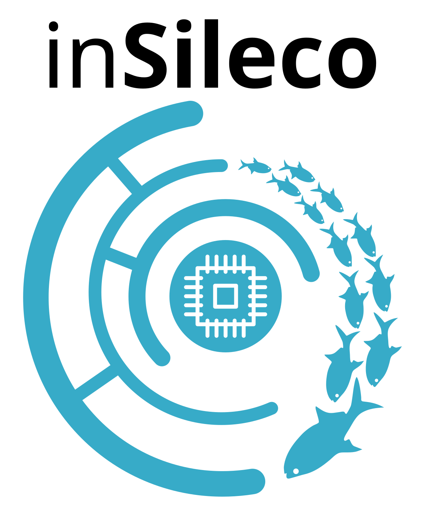
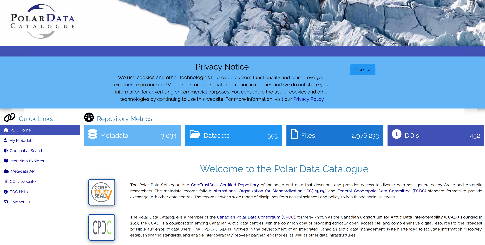

## À propos de nous

:::: {.columns}

::: {.column width="50%"}
<br>
***David Beauchesne & Kevin Cazelles***

::: {style="font-size: 80%;"}
*Co-fondateurs, inSileco*
:::

---

:::{.fragment}

::: {style="font-size: 90%;"}
- Gestion des données de recherche
- Flux de travail automatisés
- Analyses de données avancées
- Outils d'aide à la décision
:::

---

:::


:::{.fragment}
*Collaborations :*

::: {style="font-size: 80%;"}
*ArcticNet, Sentinelle Nord, ECCC, MPO, W8banaki, Wendake, AEIC, CEM*
:::

:::

:::

::: {.column width="50%"}
::: {style="display:flex; flex-direction:column; align-items:center; gap:50px; min-height:520px;"}
<div style="display:flex; flex-direction:row; flex-wrap:nowrap; justify-content:center; align-items:center; gap:40px; width:100%;">
  <a href="https://insileco.io/" target="_blank" style="display:inline-block; flex:0 0 auto; text-align:center;">
    
  </a>

  <a href="https://insileco.io/" target="_blank" style="display:inline-block; flex:0 0 auto; text-align:center;">
    
  </a>
</div>

<a href="https://insileco.io/" target="_blank" style="display:block; text-align:center; width:100%;">
  
</a>

:::
:::

::::


## À propos de nous

***inSileco*** & ***ArcticNet*** **(depuis 2023)**

- Développer des critères pour la gestion des données de projets
- Examiner et fournir des commentaires sur les plans de gestion des données des projets
- Accompagner les chercheurs dans leurs pratiques et outils de GDR
- Maintenir et enrichir les archives de données à long terme d'ArcticNet
- Offrir de la formation et du renforcement des capacités (ex. ce webinaire)


## Structure du webinaire

<br>

1. ***Contexte***
2. ***Flux de travail***
3. ***Considérations organisationnelles***
4. ***Pratique : rédigeons votre PGD***
5. ***Avenir***
6. ***Questions et réponses***

<br> 

::: {style="text-align:center; font-style:italic;"}
[https://insileco.io/fr/rdm-webinar/](https://insileco.io/fr/rdm-webinar/){target="_blank"}
:::


# Contexte

Données de recherche


## Données de recherche

::: {.fragment}

- Les chercheurs transforment des faits en connaissances
  - collectent, analysent et archivent des données de recherche

:::

:::{.fragment}

- Définitions larges :
  - informations enregistrées soutenant les résultats de recherche
    - collections structurées d'octets
:::


## Qu'est-ce que la GDR ?

::: {.callout-tip}
### GDR : Gestion des données de recherche
:::

- **Gestion active** des **données de recherche**
- Comprend la planification, la documentation, le stockage, le partage
- Englobe à la fois les **pratiques techniques** et la **gouvernance**


:::footer
[Capsule vidéo de McGill](https://www.youtube.com/watch?v=Jm7qIkrL3wM)
&nbsp; ***·*** &nbsp;
[Politique des trois organismes sur la GDR](https://science.gc.ca/site/science/en/interagency-research-funding/policies-and-guidelines/research-data-management/tri-agency-research-data-management-policy-frequently-asked-questions)
&nbsp; ***·*** &nbsp;
[Digital Curation Centre](https://www.dcc.ac.uk/guidance/curation-lifecycle-model)
:::


## Les données de recherche sont volumineuses

:::: {.columns}

::: {.callout-tip }
### GBIF : Système mondial d'information sur la biodiversité
:::

::: {.column width="50%"}
- Collecte de données à vitesse et volume sans précédent
- Ex : GBIF
  - 125 millions d'enregistrements en 2007
  - 1,6 milliard en 2020
  - **Augmentation de 1 150 % en 13 ans**
:::

::: {.column width="50%"}
[{width=100%}](img/bigData.png)
:::

::::

> Un LLM moderne est généralement entraîné avec 1x10^13 jetons de deux octets, soit 2x10^13 octets. (Yann Lecun, X, 2024)


:::footer
[Clissa *et al.* 2023. *How big is Big Data?* Frontiers in Big Data](https://www.frontiersin.org/journals/big-data/articles/10.3389/fdata.2023.1271639/full)
&nbsp; ***·*** &nbsp;
[Mason *et al.* 2021. *Data integration enables global biodiversity synthesis* PNAS](https://www.pnas.org/doi/10.1073/pnas.2018093118)
:::


## Les données de recherche sont hétérogènes

:::: {.columns}

::: {.column width="70%"}
- Les données varient considérablement entre et au sein des disciplines
- Différentes technologies, différents formats
- Nouvelles questions de recherche, nouvelles données
:::

::: {.column width="30%"}
[{width=100%}](img/variety-of-big-data-sources.png)
:::

::::

:::footer
[ColumnFive Media](https://www.columnfivemedia.com/work/infographic-intelligence-by-variety)
:::


## Les données de recherche sont précieuses


- Nous avons besoin de données fiables pour mieux comprendre et prédire
  - anticiper/atténuer les changements futurs
  - Ex : bonne évaluation des changements de température et de précipitations
- Certaines données sont difficiles et coûteuses à collecter
  - Les données arctiques en sont de bons exemples
- Les données passées et actuelles sont cruciales pour les générations futures
  - On ne peut pas collecter les données du passé
  - Des fonds publics considérables ont été dépensés pour les collecter


## Donc,


:::{.fragment}
- Les données de recherche sont volumineuses et hétérogènes
  - ➡️ difficiles à gérer
:::


:::{.fragment}
- Les données de recherche sont extrêmement précieuses
  - ➡️ doivent être gérées
:::

:::{.fragment}
**Nous devons prendre bien soin de tous les jeux de données collectés**
:::


# Flux de travail des données

## Flux de travail des données dans les projets de recherche


{width=86%, fig-align="center"}


## En résumé


:::: {.columns}


::: {.column width="60%"}

#### Collecter

- Utiliser les meilleurs protocoles
- Choisir le bon **format de données**
- Utiliser un **stockage sécurisé**

::: {.fragment}

#### Analyser

- Documenter toutes les manipulations de données
- Sauvegarder les données traitées
- Partager votre code
:::

:::

::: {.column width="40%"}
{width=100%, fig-align="center"}
:::


::::


## En résumé


:::: {.columns}


::: {.column width="60%"}

#### Archiver

- Choisir un **dépôt numérique** qui respecte les **principes clés**
- S'assurer que vos **métadonnées** sont complètes

::: {.fragment}

#### Réutiliser

- 'Futur vous' ou d'autres scientifiques
- Ajouter une **licence** à vos données
- Documenter l'utilisation de jeux de données secondaires
:::

:::

::: {.column width="40%"}
{width=100%, fig-align="center"}
:::


::::


## Documenter pour contextualiser

{width=86%, fig-align="center"}


## Documentation et métadonnées

***Métadonnées ?***

::: {style="font-size: 80%;"}
- Des données sur les données
- Décrivent le **contexte** et non le contenu
- Fournissent des champs cohérents pour *qui, quoi, où, quand, comment*
- Exemples de standards :
  - **Dublin Core** ➡️ descripteurs à usage général
  - **ISO 19115** ➡️ métadonnées géospatiales
  - **Darwin Core** ➡️ métadonnées sur la biodiversité
  - **DataCite Schema** ➡️ métadonnées de jeux de données pour les DOI
:::

::: {.callout-note}
### Standards de métadonnées vs standards de données
Les standards de métadonnées décrivent les données elles-mêmes (contexte et découverte), tandis que les standards de données définissent comment les données sont structurées. Ensemble, ils assurent l'interopérabilité et la réutilisation.
:::

:::footer
[FAIRsharing.org](https://fairsharing.org/)
:::


## Documentation et métadonnées


***Dublin Core ?***

- Un **standard de métadonnées générique** utilisé dans toutes les disciplines
- Axé sur : **qui, quoi, où, quand**
- La syntaxe est **lisible par machine** (XML, JSON) mais aussi **lisible par l'humain**

***Exemple d'enregistrement***

```xml
<record>
  <dc:title>Water Sampling Data 2025</dc:title>
  <dc:creator>Smith, J.</dc:creator>
  <dc:subject>Oceanography</dc:subject>
  <dc:date>2025-04-15</dc:date>
  <dc:format>CSV</dc:format>
  <dc:identifier>doi:10.12345/abcd</dc:identifier>
</record>
```


## Stocker vos données


{width=86%, fig-align="center"}


## Stocker vos données

- Utiliser un stockage sécurisé
- Une copie sur un seul ordinateur ne suffit pas
- Copies multiples, en utilisant le stockage sur le cloud
- Si possible, utiliser la règle de sauvegarde 3-2-1
- Quelle est la sensibilité de vos données ?


::: {.footer}
[Règle de sauvegarde 3-2-1](https://www.seagate.com/ca/en/blog/what-is-a-3-2-1-backup-strategy/)
:::


## Archiver vos données

{width=86%, fig-align="center"}


## Choisir un dépôt numérique

***Dépôts de données***

- Nationaux/Institutionnels ➡️ Dépôt fédéré de données de recherche (DFDR), Borealis
- Disciplinaires ➡️ GBIF, OBIS, GenBank, PANGAEA, PDC
- Usage général ➡️ Zenodo, Dryad, Figshare, Dataverse

***Choisir un dépôt qui est :***

- Approprié pour votre type de données et votre communauté
- De confiance (certifié, pérennité à long terme)
- Aligné sur les principes **FAIR** et **TRUST** (standards de métadonnées, identifiants pérennes)

:::footer
[Repository Finder (re3data.org)](https://www.re3data.org/)
&nbsp; ***·*** &nbsp;
[DFDR](https://www.frdr-dfdr.ca/)
&nbsp; ***·*** &nbsp;
[FAIRsharing.org](https://fairsharing.org/)
&nbsp; ***·*** &nbsp;
[Dataverse](https://dataverse.org/)
:::


## Principes [FAIR](https://www.nature.com/articles/sdata201618)

:::: {.columns}

::: {.column width="60%"}
::: {style="font-size: 80%;"}
- `(F)` Facile à trouver (*Findable*)
- `(A)` Accessible (*Accessible*)
- `(I)` Interopérable (*Interoperable*)
- `(R)` Réutilisable (*Reusable*)

**Objectifs :**

- Rendre les données faciles à découvrir grâce à des métadonnées riches
- S'assurer que les données sont accessibles sous des conditions claires
- Promouvoir l'interopérabilité entre disciplines et outils
- Permettre la réutilisation grâce aux licences et à une documentation claire

:::
:::

::: {.column width="40%" .small}
[](img/fair.png)
***Identifiants pérennes (PIDs)***
:::

::::


:::footer
[Wilkinson *et al.* 2016. *The FAIR Guiding Principles for scientific data management and stewardship*](https://www.nature.com/articles/sdata201618)
:::


## Principes [TRUST](https://datascience.codata.org/articles/10.5334/dsj-2020-043/)

:::: {.columns}

::: {.column width="50%"}
::: {style="font-size: 80%;"}
- `(T)` Transparence (*Transparency*)
- `(R)` Responsabilité (*Responsibility*)
- `(U)` Orientation utilisateur (*User Focus*)
- `(S)` Pérennité (*Sustainability*)
- `(T)` Technologie (*Technology*)
:::
:::

::: {.column width="50%"}
[](img/trust.png)
:::

::::

::: {.small}
**Objectifs :**

- Renforcer la confiance dans les dépôts numériques
- Assurer l'authenticité, l'intégrité et la fiabilité des données
- Prioriser les besoins des communautés d'utilisateurs
- Garantir la préservation et l'accessibilité à long terme
- Fournir une infrastructure sécurisée, pérenne et interopérable
:::

:::footer
[Lin *et al.* 2020. *The TRUST Principles for digital repositories* Scientific data](https://www.nature.com/articles/s41597-020-0486-7)
:::


## Polar Data Catalogue (PDC)

[{width=68% fig-align="center"}](img/pdc.png)

::: {.small}
- Dépôt certifié CoreTrustSeal : les données sont sécurisées, correctement gérées et conformes aux principes FAIR.
- Métadonnées standardisées
- Soutient les chercheurs d'ArcticNet
:::

:::footer
[CCIN - PDC](https://ccin.ca/about-pdc.html)
&nbsp; ***·*** &nbsp;
[PDC website](https://polardata.ca/)
:::


## Borealis


:::: {.columns}

::: {.column width="60%"}
::: {.callout-tip}

OCUL = Ontario Council of University Libraries
:::

> Au Canada, Borealis est une instance nationale du dépôt Dataverse hébergée par le Scholars Portal de l'OCUL à l'Université de Toronto.


:::

::: {.column width="40%"}

[](img/borealis_partners.png)

taille de fichier < 5 Go

:::

::::


:::footer
[Dataverse](https://dataverse.org)
&nbsp; ***·*** &nbsp;
[Borealis](https://borealisdata.ca/)
&nbsp; ***·*** &nbsp;
[Borealis à l'Université Laval](https://borealisdata.ca/dataverse/laval)
&nbsp; ***·*** &nbsp;
[DFDR](https://www.frdr-dfdr.ca/)
:::


## Licencier vos données

- Une licence indique aux autres comment ils peuvent utiliser vos données
- Choix courants :
  - **CC-BY** ➡️ utilisation avec attribution
  - **CC0** ➡️ aucune restriction (domaine public)
  - **Ententes personnalisées** ➡️ pour les données sensibles, autochtones ou commerciales

*Indiquez clairement la licence dans vos métadonnées, votre README ou votre fiche de dépôt*


:::footer
[Licences Creative Commons](https://creativecommons.org/licenses/)
&nbsp; ***·*** &nbsp;
[Data Management Expert Guide](https://dmeg.cessda.eu/Data-Management-Expert-Guide/6.-Archive-Publish/Publishing-with-CESSDA-archives/Licensing-your-data)
&nbsp; ***·*** &nbsp;
[How to FAIR](https://www.howtofair.dk/how-to-fair/data-licences)
&nbsp; ***·*** &nbsp;
[Politique Nature Portfolio](https://support.nature.com/en/support/solutions/articles/6000237622-select-the-right-licence-for-your-data)
:::


## Partager vos (méta)données

::: {.callout-important}
Vous ne pourrez pas toujours partager vos données, mais vous pouvez toujours partager vos métadonnées.
:::


## Aspects éthiques et juridiques


{width=86%, fig-align="center"}


## Principes [CARE](https://datascience.codata.org/articles/10.5334/dsj-2020-043/)

:::: {.columns}

::: {.column width="60%"}
::: {style="font-size: 80%;"}
- `(C)` Bénéfice collectif (*Collective Benefit*)
- `(A)` Autorité de contrôle (*Authority to Control*)
- `(R)` Responsabilité (*Responsibility*)
- `(E)` Éthique (*Ethics*)

**Objectifs :**

- Orientés vers les personnes et les objectifs
- Droits des Premières Nations sur les données et gouvernance
- Inspirés de l'[PCAP®](https://fnigc.ca/ocap-training/)
- Complètent les principes FAIR
:::
:::

::: {.column width="40%"}
[](img/care.png)
:::

::::


:::footer
[Russo Carroll *et al.* 2020. *The CARE Principles for Indigenous Data Governance*](https://datascience.codata.org/articles/10.5334/dsj-2020-043/)
:::


## Anticiper

:::: {.columns}

::: {.column width="60%"}

- Réfléchir à l'ensemble de ce processus avant de le réaliser

::: {.fragment}
- Rédigez un PGD (DMP)!

::: {.callout-tip}
### PGD : Plan de gestion des données
:::


::: {.fragment}
- Cela peut être relativement rapide

:::
:::

:::

::: {.column width="40%"}
{width=100%, fig-align="center"}
:::


::::


# Considérations organisationnelles


## La GDR dans les PRI

:::: {.columns}

::: {.column width="60%"}

::: {.callout-tip}
### PRI : Programme de recherche interdisciplinaire
:::

::: {.incremental .small}
- **Échelle et complexité** : projets, équipes et disciplines multiples
- **Continuité** : la longue durée des programmes nécessite une préservation robuste
- **Opportunités** : des données bien gérées favorisent la réutilisation, l'intégration, de nouvelles collaborations et de nouvelles perspectives
:::


::: {.fragment}
- Le réseau définira et promouvra les meilleures pratiques de GDR
:::


:::

::: {.column width="40%"}
{width=100%, fig-align="center"}

::: {.small}
- Même processus x nombre de projets !
- Efforts requis en coordination
:::
:::

::::


## Politique des trois organismes sur la GDR (2021)

- **S'applique au CRSNG, CRSH, IRSC**
- Les institutions doivent développer et publier des **stratégies institutionnelles de GDR**
- Les chercheurs doivent :
  - Préparer et maintenir des **plans de gestion des données**
  - Déposer les données dans des **dépôts de confiance** lorsque approprié
- Assure que la recherche canadienne s'aligne sur les **pratiques internationales de science ouverte**
- La conformité est de plus en plus liée aux **exigences de financement**

:::footer
[Politique des trois organismes sur la GDR](https://science.gc.ca/site/science/fr/financement-interorganismes-recherche/politiques-lignes-directrices/gestion-donnees-recherche/politique-trois-organismes-gestion-donnees-recherche-foire-aux-questions)
:::


## Principes d'ArcticNet

***En d'autres termes : ce qui est attendu de vous en tant que chercheur***


::: {style="font-size: 80%;"}
:::{.incremental}
- Les données financées par ArcticNet = un **bien public** ➡️ aussi ouvertes que possible, aussi fermées que nécessaire
- Les chercheurs doivent assurer :
  - **Partage en temps opportun** ➡️ données rendues publiques rapidement, sauf restriction
  - **Publier les métadonnées** ➡️ publier et partager vos métadonnées (ex. Polar Data Catalogue)
  - **Respect des droits autochtones** ➡️ respecter la propriété, l'accès et le contrôle des Inuits, des Premières Nations et des Métis (CARE, PCAP®, SDRNI)
  - **Citables et préservées** ➡️ les données doivent être publiables, citables et préservées lorsque approprié
  - **Interopérabilité et connectivité** ➡️ lien avec les systèmes de données arctiques canadiens et internationaux, éviter la duplication
  - **Meilleures pratiques** ➡️ suivre les exigences éthiques, juridiques, culturelles et des bailleurs de fonds ; utiliser l'infrastructure existante lorsque possible
  - **Soutien et accompagnement** ➡️ les chercheurs s'engagent dans la formation, la sensibilisation et les ressources fournies
:::
:::

:::footer
[Politique de gestion des données d'ArcticNet (2025)](https://arcticnet.ca/wp-content/uploads/2025/03/ArcticNet-Data-Management-Policy-ADMP_Approved-March-2025.pdf)
:::


## Calendrier et double responsabilité

*Réseau : équilibrer autonomie et coordination*

{width=100%}


## Calendrier et double responsabilité

*Chercheurs : gérer et documenter les données du projet de manière responsable*


{width=100%}


<!-- ~~~~~~~~~~~~~~~~~~~~~~~~~~~~~~~~~~~~~~~~~~~~~~~~~~~~~~~~~~~~~~~~~~~~~~~~~~~~~~~~~~~~~~~~~~~~~~~~~~~~~~~~~~~~~~~~~~~~ -->
# *Guide pratique*

Construire votre plan de gestion des données

<!-- ~~~~~~~~~~~~~~~~~~~~~~~~~~~~~~~~~~~~~~~~~~~~~~~~~~~~~~~~~~~~ -->


## Qu'est-ce qu'un PGD ?

::: {.callout-tip}
### PGD : Plan de gestion des données
:::

> Un plan de gestion des données (PGD) est un document formel, généralement de 1 à 2 pages, qui décrit comment les données seront gérées pendant et après un projet.


:::footer
[Capsule vidéo de McGill](https://www.youtube.com/watch?v=p_JzQxxC4ts)
&nbsp; ***·*** &nbsp;
[Guide de Harvard](https://datamanagement.hms.harvard.edu/plan-design/data-management-plans)
&nbsp; ***·*** &nbsp;
[Modèles de l'Assistant PGD](https://dmp-pgd.ca/public_templates)
:::


## Qu'est-ce qu'un PGD ?

::: {.callout-tip}
### PGD : Plan de gestion des données
:::

***Avantages :***


::: {style="font-size: 80%;"}
:::{.incremental}
- Exigé par de nombreux organismes subventionnaires, dont les trois organismes (IRSC, CRSNG et CRSH)
- Assure la faisabilité des propositions de recherche
- Démontre une gestion responsable des fonds publics
- Établit les attentes en matière de stockage, de partage et de préservation
- Fondement d'une bonne collaboration et réutilisation
- Facilite la conformité avec certaines revues
- Améliore la visibilité et les citations des jeux de données
:::
:::

:::footer
[Capsule vidéo de McGill](https://www.youtube.com/watch?v=p_JzQxxC4ts)
&nbsp; ***·*** &nbsp;
[Guide de Harvard](https://datamanagement.hms.harvard.edu/plan-design/data-management-plans)
&nbsp; ***·*** &nbsp;
[Modèles de l'Assistant PGD](https://dmp-pgd.ca/public_templates)
:::


## Pourquoi les PGD comptent dans les PRI

- PRI = **écosystèmes distribués** ➡️ objectifs, données et pratiques diversifiés
- Les PGD collectifs donnent de la **visibilité** sur les résultats attendus
- Permettent une **coordination précoce** des standards et outils
- Révèlent des **chevauchements, synergies et possibilités de partage des coûts**
- Réduisent la duplication et améliorent la cohérence du programme


## Sections clés d'un PGD

:::{.callout-tip}
### Répondez à ces questions **avec substance** et vous aurez un PGD complet :
:::

::: {style="font-size: 80%;"}
::: {.incremental}
1. <i class="fa-regular fa-circle"></i> **Collecte de données** ➡️ Quelles données, formats, volume, protocoles ?
2. <i class="fa-regular fa-circle"></i> **Documentation et métadonnées** ➡️ Comment les données seront-elles décrites ? Quels standards ?
3. <i class="fa-regular fa-circle"></i> **Stockage et protection** ➡️ Où seront les données de travail et comment seront-elles protégées ?
4. <i class="fa-regular fa-circle"></i> **Analyse des données** ➡️ Comment les données seront-elles analysées ?
5. <i class="fa-regular fa-circle"></i> **Préservation et archivage** ➡️ Quel dépôt, quels formats pour le long terme ?
6. <i class="fa-regular fa-circle"></i> **Partage et réutilisation** ➡️ Qui peut y accéder, quand, sous quelle licence ?
7. <i class="fa-regular fa-circle"></i> **Aspects juridiques et éthiques** ➡️ Comment les questions juridiques, de vie privée, de consentement et de droits autochtones sur les données sont-elles abordées ?
:::
:::

## Outils et modèles

- Utilisez les outils disponibles si possible
  - [Assistant PGD](https://dmp-pgd.ca/) (outil en ligne du Canada)
  - [DMP Tool](https://dmptool.org/)
- Le réseau peut fournir un **modèle** adapté à votre programme
- Exemples et conseils disponibles sur :
  - [Ressources PGD de Harvard](https://datamanagement.hms.harvard.edu/plan-design/data-management-plans)
  - [Vidéos de McGill](https://www.youtube.com/watch?v=p_JzQxxC4ts)


## Bonnes pratiques

:::{.callout-tip}
### Conseils pour le PGD

:::{.incremental}
- **Commencez tôt** ➡️ ébauchez le PGD dès l'étape de la proposition
- Traitez-le comme un **document vivant** ➡️ mettez-le à jour au fur et à mesure de l'évolution du projet
- Réutilisez les formulaires / standards de métadonnées existants lorsque possible (plus de détails à venir)
- Restez concis mais **opérationnel**
- Alignez-vous sur les principes **FAIR, CARE et TRUST**
:::
:::


<!-- ~~~~~~~~~~~~~~~~~~~~~~~~~~~~~~~~~~~~~~~~~~~~~~~~~~~~~~~~~~~~ -->

# Guide pratique

## Objectif

<br>

***Outiller les chercheurs avec des étapes concrètes pour gérer les données de manière responsable, efficace et conforme aux attentes du réseau et des organismes subventionnaires.***

<br>

***À la fin, vous devriez savoir quelles étapes entreprendre pour préparer et mettre à jour un plan de gestion des données adéquat***

## Objectif

***Créons un PGD ensemble. Commençons [ici](https://insileco.io/fr/rdm-webinar/dmp_form/).***

<a href="https://insileco.io/fr/rdm-webinar/dmp_form/" target="_blank">
  
</a>


## Liste de vérification

::: {style="font-size: 90%;"}
<i class="fa-regular fa-circle"></i> *Collecte de données*

<i class="fa-regular fa-circle"></i> *Documentation et métadonnées*

<i class="fa-regular fa-circle"></i> *Stockage et protection*

<i class="fa-regular fa-circle"></i> *Analyse des données*

<i class="fa-regular fa-circle"></i> *Préservation et archivage*

<i class="fa-regular fa-circle"></i> *Partage et réutilisation*

<i class="fa-regular fa-circle"></i> *Aspects juridiques et éthiques*

:::

<!--
{width=20%}
{width=20%}
{width=20%}
-->


<!-- ~~~~~~~~~~~~~~~~~~~~~~~~~~~~~~~~~~~~~~~~~~~~~~~~~~~~~~~~~~~~ -->
# Collecte de données

<div style="width:20%; margin: 0 auto;">
  
</div>

## Collecte de données

***Questions directrices***

::: {style="font-size: 80%;"}
- Quels types de données vais-je collecter ?
  - *observationnelles, expérimentales, computationnelles, dérivées*
- Quels instruments, capteurs ou méthodes vais-je utiliser ?
  - *protocoles de terrain, capteurs, analyses en laboratoire, pipelines logiciels*
- Comment vais-je assurer le contrôle de qualité avant, pendant et après la collecte ?
  - *calibration, échantillons en double, vérification des erreurs*
- Comment vais-je organiser et nommer les fichiers ?
  - *noms de fichiers/dossiers cohérents, vocabulaires contrôlés*
:::


## Collecte de données

***Assurance qualité / Contrôle qualité (AQ/CQ)***

::: {style="font-size: 80%;"}
- **Avant la collecte** ➡️ calibration des instruments, protocoles standardisés
- **Pendant la collecte** ➡️ échantillons en double/triple, échantillons témoins, blancs de terrain
- **Après la collecte** ➡️ vérifications de validation, détection d'erreurs, suivi des versions
:::


## Collecte de données

***Organisation et nommage***

::: {style="font-size: 80%;"}
- Utilisez des **noms de fichiers et dossiers cohérents et descriptifs**
- Évitez les espaces/caractères spéciaux ➡️ utilisez `_` ou `-`.
- Incluez le **versionnage et les dates** (ex. `projetA_echantillons_2025-03-01_v1.csv`)
- Organisez les dossiers par projet/étude/site/date plutôt que selon les préférences du chercheur
- Utilisez des **vocabulaires contrôlés / ontologies** lorsque disponibles ➡️ interopérabilité
:::

<br>

::: {.callout-tip}
### À faire et à ne pas faire
✅ `lacC_notes_terrain_2025-03-01_v2.csv`
❌ `data latest & updated.xlsx`
:::

:::footer
[Cornell RDM: File Organization](https://data.research.cornell.edu/data-management/storing-and-managing/file-management/)
&nbsp; ***·*** &nbsp;
[Stanford Libraries: File Naming](https://guides.library.stanford.edu/data-best-practices)
&nbsp; ***·*** &nbsp;
[FAIRsharing](https://fairsharing.org/)
&nbsp; ***·*** &nbsp;
[OBO Foundry](http://obofoundry.org/)
&nbsp; ***·*** &nbsp;
[TDWG](https://www.tdwg.org/)
:::


<!-- ~~~~~~~~~~~~~~~~~~~~~~~~~~~~~~~~~~~~~~~~~~~~~~~~~~~~~~~~~~~~ -->

# Documentation et métadonnées

<div style="width:20%; margin: 0 auto;">
  
</div>

## Documentation et métadonnées

***Questions directrices***

::: {style="font-size: 80%;"}
- Comment vais-je documenter mes données pour que d'autres (ou mon futur moi) puissent les comprendre ?
  - *cahiers de laboratoire/terrain, dictionnaires de données, fichiers README, protocoles*
- Quel(s) standard(s) de métadonnées vais-je utiliser ?
  - *Dublin Core, ISO 19115, Darwin Core, DataCite Schema*
- Quand les métadonnées seront-elles créées et mises à jour ?
  - *dès le début du projet, mises à jour régulièrement, finalisées à l'archivage*
:::


## Documentation et métadonnées


:::: {.columns}

::: {.column width="50%"}
::: {.callout-important}
### Exigences d'ArcticNet

::: {style="font-size: 80%;"}
- À partir de l'année 2, les chercheurs doivent fournir des liens vers des fiches de métadonnées dans des dépôts reconnus
- Les métadonnées doivent être ouvertement accessibles
- Le financement sera retenu si les fiches de métadonnées sont manquantes ou inaccessibles
- Pour les données appartenant aux Autochtones ➡️ les chercheurs doivent identifier l'organisation responsable de leur stockage et gestion
  - La publication des métadonnées reste requise
:::
:::
:::

::: {.column width="50%"}
::: {.callout-note}
### Engagement d'ArcticNet

::: {style="font-size: 80%;"}
***Rôle :***

- Définir les standards de métadonnées pour les projets
- Accompagner les chercheurs dans la préparation des métadonnées
- Fournir des outils/modèles pour faciliter la soumission des métadonnées

***Initiatives***

- Travail avec le Polar Data Catalogue (PDC) pour héberger les métadonnées des projets
- Fourniture d'un modèle de métadonnées PDC
- Offre de soutien pour la préparation et la soumission
:::
:::
:::

::::

:::footer
[Politique de gestion des données d'ArcticNet (2025)](https://arcticnet.ca/wp-content/uploads/2025/03/ArcticNet-Data-Management-Policy-ADMP_Approved-March-2025.pdf)
&nbsp; ***·*** &nbsp;
[Pacharra *et al.* 2025. From Bench to Brain: A Metadata-driven Approach to Research Data Management in a Collaborative Neuroscientific Research Center.](https://datascience.codata.org/articles/10.5334/dsj-2025-002)
:::


<!-- ~~~~~~~~~~~~~~~~~~~~~~~~~~~~~~~~~~~~~~~~~~~~~~~~~~~~~~~~~~~~ -->
# Stockage et protection

<div style="width:20%; margin: 0 auto;">
  
</div>

## Stockage et protection


***Questions directrices***

- Où les données seront-elles stockées pendant le projet ?
  - serveurs institutionnels, stockage infonuagique certifié, supports externes
- À quelle fréquence et où les sauvegardes sont-elles effectuées, et sont-elles automatisées ?
  - fréquence, nombre de copies, emplacements
- Qui peut accéder aux données et comment l'accès est-il protégé ?
  - permissions, authentification, chiffrement
- Quelle capacité de stockage sera nécessaire ?
  - besoins de stockage prévus (Go/To)
- Qui fournit, paie et maintient le stockage et les sauvegardes ?
  - qui paie et quelle infrastructure est fournie


## Stockage et protection


:::: {.columns}

::: {.column width="50%"}
::: {.callout-tip}
### Bonnes pratiques

::: {style="font-size: 80%;"}
- Privilégier le stockage institutionnel ou certifié plutôt que les ordinateurs portables/clés USB personnels
- Utiliser un stockage chiffré pour les données sensibles
- Automatiser les sauvegardes autant que possible
- Documenter clairement les pratiques de stockage dans le PGD
- Planifier la préservation à long terme (plus de détails bientôt)
:::
:::
:::

::: {.column width="50%"}
::: {.callout-warning}
### Considérations particulières

::: {style="font-size: 80%;"}
- Données sensibles / autochtones ➡️ utiliser des mesures de protection approuvées par la communauté, respecter la souveraineté
- Grands volumes / « mégadonnées » ➡️ aborder l'infrastructure, les coûts, les serveurs spécialisés
- Contraintes de terrain ➡️ décrire les solutions temporaires (ordinateurs portables de terrain, disques portables) et comment les données seront sécurisées jusqu'au téléchargement
:::
:::
:::

::::


<!-- ~~~~~~~~~~~~~~~~~~~~~~~~~~~~~~~~~~~~~~~~~~~~~~~~~~~~~~~~~~~~ -->
# Analyse des données

<div style="width:20%; margin: 0 auto;">
  
</div>

## Analyse des données


***Questions directrices***

- Quels logiciels, outils ou pipelines seront utilisés ?
  - *R, Python, MATLAB, ArcGIS, QGIS, etc.*
- Comment les étapes d'analyse seront-elles documentées ?
  - *scripts, carnets Jupyter, R Markdown, Quarto*
- Comment assurerez-vous la reproductibilité ?
  - *contrôle de version (GitHub, GitLab), conteneurs (Docker)*


## Analyse des données


## Analyse des données


:::: {.columns}

::: {.column width="50%"}
::: {.callout-tip}
### Bonnes pratiques

::: {style="font-size: 80%;"}
- Privilégier les outils à code source ouvert lorsque possible
- Partager les scripts d'analyse avec vos jeux de données
- Séparer les données brutes et traitées.
- Documenter les hypothèses, paramètres et versions des logiciels

*Renforce la confiance, l'efficacité et l'utilité à long terme des résultats*
:::
:::
:::

::: {.column width="50%"}
::: {.callout-note}
### Une note sur la reproductibilité
[{width=80%}](img/reproducibility.png)
:::
:::

::::


:::footer
[Atelier inSileco sur la reproductibilité](https://insileco.io/workshop_reproducibility/)
:::


<!-- ~~~~~~~~~~~~~~~~~~~~~~~~~~~~~~~~~~~~~~~~~~~~~~~~~~~~~~~~~~~~ -->
# Préservation et archivage

<div style="width:20%; margin: 0 auto;">
  
</div>

## Préservation et archivage


***Questions directrices***

- Quel dépôt de confiance sera utilisé pour la préservation à long terme ?
  - *Borealis, DFDR, Dryad, Zenodo, GBIF, OBIS*
- Dans quels formats les données seront-elles archivées ?
  - *CSV, NetCDF, GeoTIFF, JSON (éviter les formats avec perte comme JPEG, MP3)*
- Comment les jeux de données seront-ils identifiés et cités de manière pérenne ?
  - *DOI, URI*
- Pendant combien de temps les données seront-elles préservées ?
  - *généralement ≥ 5–10 ans, idéalement indéfiniment*

*Objectif : s'assurer que vos données restent utilisables et accessibles bien au-delà du projet*


## Préservation et archivage


:::: {.columns}

::: {.column width="50%"}
::: {.callout-tip}
### Bonnes pratiques

::: {style="font-size: 80%;"}
- Déposer les données au moment de la publication, pas des années plus tard
- Archiver les données brutes et traitées, lier aux scripts d'analyse
- Utiliser les fonctionnalités de versionnage du dépôt plutôt que des noms de fichiers manuels
- Assurer l'alignement avec les principes FAIR et CARE
:::
:::
:::

::: {.column width="50%"}
::: {.callout-warning}
### Considérations particulières

::: {style="font-size: 80%;"}
- Données sensibles ➡️ anonymisation, accès restreint, stockage sécurisé à long terme
- Souveraineté des données autochtones ➡️ respecter CARE, PCAP®, SDRNI, protocoles communautaires
- Grands volumes ➡️ considérer des dépôts spécialisés, le CHP ou des archives infonuagiques
:::
:::
:::

::::


## Préservation et archivage


***Quelques notes sur les formats de fichiers***

:::: {.columns}

::: {.column width="50%"}
::: {.callout-warning}
### Éviter les formats propriétaires et inadaptés

::: {style="font-size: 80%;"}
- Tous les formats ne sont pas durables pour les données de recherche à long terme. Évitez :
- Formats propriétaires : nécessitent un logiciel spécifique qui peut devenir indisponible (ex. .xlsx, .shp, .sav, .psd, .docx avec macros)
- Formats avec forte dépendance aux versions : les versions plus anciennes/récentes peuvent être illisibles sans le logiciel exact (ex. types de fichiers exclusifs à ArcGIS)
- Formats compressés / avec perte : réduisent la qualité des données et limitent la réutilisation (ex. .jpg, .mp3)
- Fichiers chiffrés ou protégés par mot de passe : bloquent la découverte, la réutilisation et les flux de préservation

**Règle générale :** si un fichier nécessite un logiciel spécial, ou risque de perdre de l'information lors de l'enregistrement, ce n'est pas un bon format d'archivage.
:::
:::
:::

::: {.column width="50%"}
::: {.callout-tip}
### Formats ouverts recommandés par type de données

::: {style="font-size: 100%;"}
- Données tabulaires ➡️ CSV, Parquet
- Données spatiales ➡️ GeoPackage, GeoTIFF, NetCDF
- Images ➡️ TIFF (non compressé), PNG
- Audio / Vidéo ➡️ WAV, MP4 (codec H.264)
- Textes / Documents ➡️ TXT, PDF/A, XML, JSON
- Métadonnées ➡️ XML, JSON, schémas standardisés (ex. ISO 19115, Darwin Core)

- Choisir des formats qui sont :
  - Ouverts et non propriétaires
  - Bien documentés et largement supportés
  - Durables pour la préservation à long terme
:::
:::
:::

::::


## Préservation et archivage


:::: {.columns}

::: {.column width="50%"}
::: {.callout-important}
### Exigences d'ArcticNet

::: {style="font-size: 80%;"}
- Pas de dépôt centralisé ArcticNet ➡️ les projets choisissent un dépôt à long terme approprié
- Privilégier les options certifiées et en accès libre (PDC, Nordicana-D, GBIF, OBIS, DFDR)
- Déposer toutes les données et métadonnées appuyant les résultats
- Planifier tôt, utiliser des formats non propriétaires (CSV, TIFF, NetCDF)
- Conserver les données aussi longtemps que requis par les parties prenantes et les organismes subventionnaires
- Indiquer dans le PGD ce qui sera préservé et toute restriction
:::
:::
:::

::: {.column width="50%"}
::: {.callout-note}
### Recommandations d'ArcticNet

::: {style="font-size: 80%;"}
- Les chercheurs décident du dépôt le plus approprié pour leur discipline et type de données
- Se concentrer sur la pérennité du dépôt, les DOI et l'accès libre
- La préservation peut inclure les données brutes, traitées et dérivées lorsque pertinent
- Les données sensibles ou autochtones peuvent nécessiter un accès restreint ou des mesures de protection
- La justification de la conservation et de la préservation doit être claire dans le PGD
:::
:::
:::

::::

:::footer
[Politique de gestion des données d'ArcticNet (2025)](https://arcticnet.ca/wp-content/uploads/2025/03/ArcticNet-Data-Management-Policy-ADMP_Approved-March-2025.pdf)
:::


<!-- ~~~~~~~~~~~~~~~~~~~~~~~~~~~~~~~~~~~~~~~~~~~~~~~~~~~~~~~~~~~~ -->
# Partage et réutilisation

<div style="width:20%; margin: 0 auto;">
  
</div>

## Partage et réutilisation


***Questions directrices***

- Qui peut accéder aux données et quand ?
  - *ouvert, sous embargo ou restreint*
- Quelle licence régira la réutilisation ?
  - *CC-BY, CC0 ou conditions personnalisées*
- Comment les données seront-elles documentées ?
  - *les métadonnées et le README assurent que d'autres peuvent réutiliser les données*

*Objectif : rendre les données disponibles de manière claire, utilisable et responsable*


## Partage et réutilisation


:::: {.columns}

::: {.column width="50%"}
::: {.callout-tip}
### Bonnes pratiques

::: {style="font-size: 80%;"}
- Utiliser des dépôts qui supportent les DOI et les licences
- Publier des articles de données ou citer les DOI des jeux de données dans les articles
- Lier les données aux publications, au code et aux jeux de données connexes
- Être transparent sur les conditions de réutilisation
:::
:::
:::

::: {.column width="50%"}
::: {.callout-warning}
### Considérations particulières

::: {style="font-size: 80%;"}
- Données commercialement sensibles ➡️ embargos ou accès restreint
- Collaborations ➡️ partage progressif (interne d'abord, ouvert ensuite)
:::
:::
:::

::::

## Partage et réutilisation


:::: {.columns}

::: {.column width="50%"}
::: {.callout-important}
### Exigences d'ArcticNet

::: {style="font-size: 80%;"}
- Les données doivent être trouvables, accessibles, interopérables et réutilisables (FAIR)
- Métadonnées publiées tôt dans un catalogue reconnu (ex. re3data, PDC, DFDR)
- Déposer les données dans un dépôt de confiance avec des identifiants pérennes (DOI)
- Les utilisateurs doivent citer et reconnaître les créateurs de données
- Toute restriction (sensible, autochtone, sécurité) doit être justifiée dans le PGD
:::
:::
:::

::: {.column width="50%"}
::: {.callout-note}
### Recommandations d'ArcticNet

::: {style="font-size: 80%;"}
- Rendre les données disponibles aussi ouvertement et rapidement que possible, avec un délai minimal
- « Aussi ouvert que possible, aussi fermé que nécessaire » (considérations éthiques et juridiques)
- Les données autochtones et sensibles nécessitent des mesures de protection, un consentement éclairé et le respect de la souveraineté (CARE, PCAP®, SDRNI)
- Des embargos ou un accès restreint peuvent s'appliquer, mais doivent être transparents et limités dans le temps
- Les demandes d'accès aux données ne devraient pas être refusées de manière déraisonnable
:::
:::
:::

::::

:::footer
[Politique de gestion des données d'ArcticNet (2025)](https://arcticnet.ca/wp-content/uploads/2025/03/ArcticNet-Data-Management-Policy-ADMP_Approved-March-2025.pdf)
:::


<!-- ~~~~~~~~~~~~~~~~~~~~~~~~~~~~~~~~~~~~~~~~~~~~~~~~~~~~~~~~~~~~ -->
# Aspects juridiques et éthiques

<div style="width:20%; margin: 0 auto;">
  
</div>

## Aspects juridiques et éthiques


***Questions directrices***

- Des approbations éthiques sont-elles requises ?
  - *comités d'éthique de la recherche / comités d'examen institutionnels, examen communautaire*
- Des connaissances ou données autochtones seront-elles collectées ?
  - *CARE, PCAP®, SDRNI, ententes communautaires*
- À qui appartiennent les données et comment la propriété intellectuelle sera-t-elle gérée ?
  - *propriété, licences, ententes industrielles*
- Y a-t-il des restrictions juridiques sur les données ?
  - *trois organismes, lois sur la vie privée, obligations internationales*


## Aspects juridiques et éthiques


:::: {.columns}

::: {.column width="50%"}
::: {.callout-tip}
### Bonnes pratiques

::: {style="font-size: 80%;"}
- Données sensibles ou autochtones ➡️ respecter CARE, PCAP® et les protocoles communautaires
- Expliquer clairement comment les droits des participants sont protégés
- Utiliser des ententes écrites de partage de données lorsque applicable
- Consulter la gouvernance communautaire pour la recherche autochtone
- Être transparent sur les données qui ne peuvent pas être partagées et pourquoi
:::
:::
:::

::: {.column width="50%"}
::: {.callout-warning}
### Considérations particulières

::: {style="font-size: 80%;"}
- Institutions multiples ➡️ harmoniser les exigences éthiques et juridiques
- Les partenaires autochtones peuvent exiger des dépôts communautaires ou un accès contrôlé
- Considérer le transfert transfrontalier de données et la conformité
:::
:::
:::

::::


# *Avenir*

Tendances émergentes et opportunités


## L'avenir de la GDR dans les PRI

:::{.incremental}
- PRI : équipes, méthodes, types de données et cultures de données diversifiés
- Une gouvernance entièrement centralisée est irréaliste
- Besoin d'approches flexibles qui :
  - préservent l'autonomie des projets
  - permettent la coordination
- Solution : outils modulaires et interopérables
- Prochaine étape pour la GDR dans les PRI : **métadonnées interopérables**
:::


## Carrefours de métadonnées interopérables


<!-- Replace with your two hub screenshots / links -->
:::: {.columns}

::: {.column width="50%"}
***Carrefour de données ArcticNet***

:::

::: {.column width="50%"}
***Carrefour d'évaluation régionale***

:::

::::


## Des métadonnées à l'interopérabilité

:::{.incremental}
- Interopérabilité des métadonnées = chemin vers l'interopérabilité des données
- Combinée aux identifiants pérennes : des actifs découvrables, liables et réutilisables
- Permet :
  - la découverte et la synthèse inter-projets
  - des flux de travail automatisés
  - des tableaux de bord, la validation et le suivi de la réutilisation
  - des applications d'IA / LLM (graphes de connaissances, découverte assistée, questions-réponses)
:::


<!-- ~~~~~~~~~~~~~~~~~~~~~~~~~~~~~~~~~~~~~~~~~~~~~~~~~~~~~~~~~~~~~~~~~~~~~~~~~~~~~~~~~~~~~~~~~~~~~~~~~~~~~~~~~~~~~~~~~~~~ -->

#

::: {style="font-size: 120%;"}
***Merci !***
:::


::: {style="text-align:center; margin-top: 2.2rem;"}

::: {style="font-size: 90%;"}
*Si vous travaillez sur des plans de gestion des données, l'harmonisation des métadonnées ou la coordination de programmes de recherche, nous serons heureux de poursuivre la discussion.*
:::

<div style="display:flex; justify-content:center; align-items:center; gap:50px; margin-top:0.8rem;">
  <a href="mailto:david.beauchesne@insileco.io" target="_blank">
    
  </a>

  <a href="https://insileco.io/en?utm_campaign=an_rdm" target="_blank">
    
  </a>

  <a href="mailto:kevin.cazelles@insileco.io" target="_blank">
    
  </a>
</div>

::: {style="font-size: 90%;"}
Nous apprécierions également grandement vos commentaires !
:::

<a href="https://insileco.io/fr/rdm-webinar/rdm_feedback/" target="_blank">
  
</a>
:::
