# About Us 


## About Us

::: {style="text-align: center;"}
[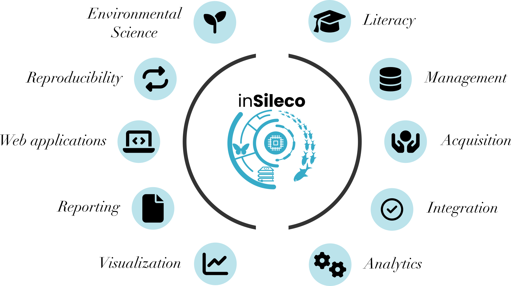{width=80%}](https://insileco.io/){target="_blank"}
:::

## About Us 

***inSileco*** & ***ArcticNet*** **(since 2023)**

- Develop criteria for project Data Management
- Review and provide feedback on project Data Management Plans
- Support researchers with RDM practices and tools
- Maintain and expand ArcticNet’s long-term data archive
- Deliver training and capacity building (e.g. this webinar)


## Webinar Structure  

<br>

1. ***Context***
2. ***Workflow***
3. ***Organizational considerations***
4. ***Practice: let's draft your DMP*** 
5. ***Future***
6. ***Q&A***


# Context

RDM, Data & Open Science


## Research Data  

::: {.fragment}

- Researchers transform facts into knowledge 
  - collect, analyze and archive research data

:::

:::{.fragment}

- Broad definitions: 
  - recorded information supporting research findings
    - structured collections of bytes
:::


## What is RDM?

::: {.callout-tip}
### RDM: Research Data Management
:::

- **Active management** of **research data**
- Includes planning, documentation, storage, sharing  
- Encompasses both **technical practices** and **governance**


:::footer
[McGill video capsule](https://www.youtube.com/watch?v=Jm7qIkrL3wM)
&nbsp; ***·*** &nbsp;
[Tri-Agency RDM Policy](https://science.gc.ca/site/science/en/interagency-research-funding/policies-and-guidelines/research-data-management/tri-agency-research-data-management-policy-frequently-asked-questions)
&nbsp; ***·*** &nbsp;
[Digital Curation Centre](https://www.dcc.ac.uk/guidance/curation-lifecycle-model)
:::


## Research Data are Big

:::: {.columns}

::: {.callout-tip }
### GBIF: Global Biodiversity Information Facility
:::

::: {.column width="50%"}
- Powerful technologies enabling unprecedented data collection
- Ex: GBIF
  - 125 million records in 2007 
  - 1.6 billion in 2020
  - **1,150% increase in just 13 years**
:::

::: {.column width="50%"}
[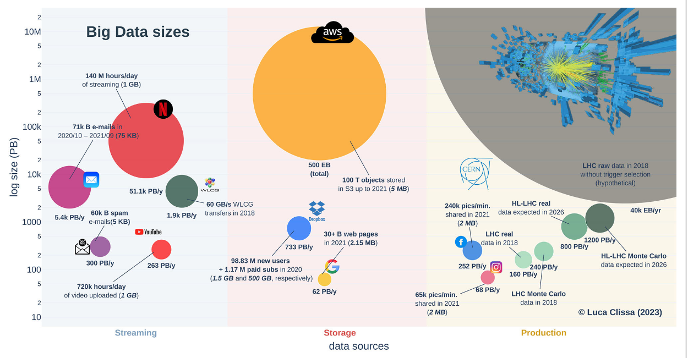{width=100%}](img/bigData.png)
:::

:::: 

> A modern LLM is typically trained with 1x10^13 two-byte tokens, which is 2x10^13 bytes. (Yann Lecun, X, 2024)


:::footer 
[Clissa *et al.* 2023. *How big is Big Data?* Frontiers in Big Data](https://www.frontiersin.org/journals/big-data/articles/10.3389/fdata.2023.1271639/full)
&nbsp; ***·*** &nbsp;
[Mason *et al.* 2021. *Data integration enables global biodiversity synthesis* PNAS](https://www.pnas.org/doi/10.1073/pnas.2018093118)
:::


## Research Data are Heterogeneous

:::: {.columns}

::: {.column width="70%"}
- New research questions, new data 
- Different objects, storage formats, technologies  
- Data vary widely across and within disciplines  
- One researcher handles a wide array of types of data
:::

::: {.column width="30%"}
[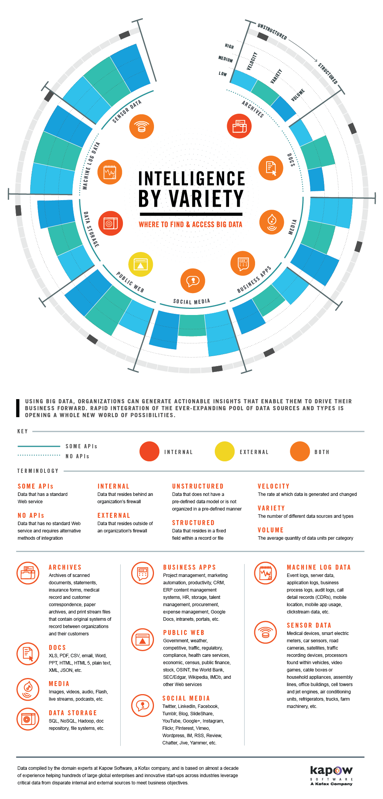{width=100%}](img/variety-of-big-data-sources.png)
:::

:::: 

:::footer
[ColumnFive Media](https://www.columnfivemedia.com/work/infographic-intelligence-by-variety)
:::


## Research Data are Valuable


- We need reliable data to better understand and predict
  - anticipate/mitigate future changes
  - Ex: good assessment of temperature and precipitation change
- Some data are hard (and expensive) to collect
  - Arctic Data are good examples
- Data are **precious** for future generations
  - We cannot collect past data
  - considerable past public money has been spent to collect them


## So,

- Research data are big and heterogeneous
- Research data are extremely valuable 

:::{.fragment}
**Let's take good care of all collected datasets**
:::


# Data Workflow 

## Data Workflow in Research Projects


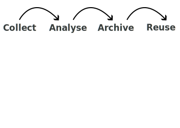{width=86%, fig-align="center"}


## In a nutshell 


:::: {.columns}


::: {.column width="60%"}

#### Collect 

- Use the best protocols
- Choose the right **data format**
- Use **secured storage** 

::: {.fragment}

#### Analyse

- Report all data manipulations
- Save processed data
- Share your code
:::

:::

::: {.column width="40%"}
{width=100%, fig-align="center"}
:::


::::


## In a Nutshell 


:::: {.columns}


::: {.column width="60%"}

#### Archive

- Choose a **platform** that respects **key principles**
- ensure that your **metadata** are complete

::: {.fragment}

#### Reuse

- Future you or others
- **License** your data 
- Report secondary data usage 
:::

:::

::: {.column width="40%"}
{width=100%, fig-align="center"}
:::


::::


## Document to Contextualize

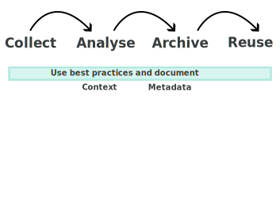{width=86%, fig-align="center"}


## Documentation & Metadata  

***What are metadata & metadata standards?***  

::: {style="font-size: 80%;"}  
- Data that describes the datasets
- Describe the **context,** not the content  
- Provide consistent fields for *who, what, where, when, how* 
- Standard Examples:  
  - **Dublin Core** ➡️ general-purpose descriptors  
  - **ISO 19115** ➡️ geospatial metadata  
  - **Darwin Core** ➡️ biodiversity metadata  
  - **DataCite Schema** ➡️ dataset metadata for DOIs  
:::  

::: {.callout-note}  
### Metadata standards vs Data standards  
Metadata standards describe the data itself (context & discovery), while data standards define how the data is structured. Together, they ensure interoperability and reuse.  
:::  

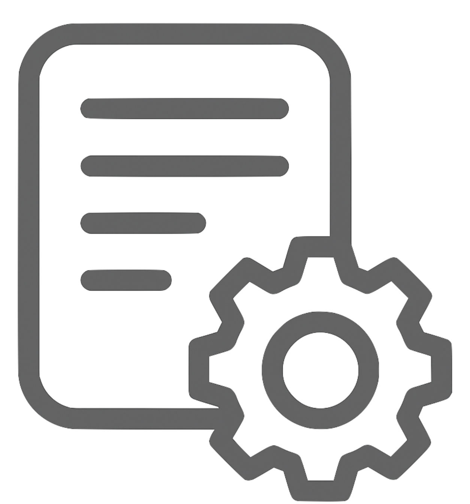

:::footer  
[FAIRsharing.org](https://fairsharing.org/)  
:::


## Documentation & Metadata  


***Dublin Core: What is it?***

- A **generic metadata standard** used across disciplines  
- Provides a **basic set of 15 elements** to describe digital objects  
- Focused on: **who, what, where, when**  
- Works across repositories, making datasets **findable and shareable**  

**Core elements (examples):**  
- `title`, `creator`, `subject`, `date`, `format`, `identifier`  

💡 Often extended with qualifiers to add more precision  

## Documentation & Metadata  


***Dublin Core: The Grammar***

- Based on **element–value pairs**  
  - Element = the property being described  
  - Value = the information recorded  
- Syntax is **machine-readable** (XML, JSON) but also **human-readable**  
- Flexible: can be embedded in repositories, DOIs, web pages  

**Example pattern:**  
- `dc:title` ➡️ "Water Sampling Data 2025"  
- `dc:creator` ➡️ "Smith, J."  
- `dc:date` ➡️ "2025-04-15"  

## Documentation & Metadata  


***Dublin Core: Example Record***

```xml
<record>
  <dc:title>Water Sampling Data 2025</dc:title>
  <dc:creator>Smith, J.</dc:creator>
  <dc:subject>Oceanography</dc:subject>
  <dc:date>2025-04-15</dc:date>
  <dc:format>CSV</dc:format>
  <dc:identifier>doi:10.12345/abcd</dc:identifier>
</record>
```


## Storing your Data 


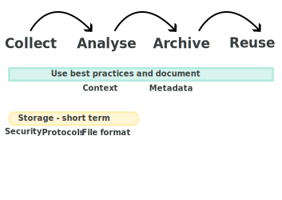{width=86%, fig-align="center"}


## Storing your Data 

- Use a secured storage
- Multiple copies, using cloud
- If possible use the 3-2-1 backup rule 
- How sensitive are your data?


::: {.footer}
[3-2-1 Backup Rule](https://www.seagate.com/ca/en/blog/what-is-a-3-2-1-backup-strategy/)
:::


## Archiving your Data 

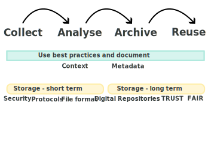{width=86%, fig-align="center"}


## Select a Digital Repository

***Data repositories***

- National/Institutional ➡️ Federated Research Data Repository (FRDR), Borealis
- Disciplinary ➡️ GBIF, OBIS, GenBank, PANGAEA
- General-purpose ➡️ Zenodo, Dryad, Figshare, Dataverse

***Choose a repository that is:***

- Appropriate for your data type & community  
- Trusted (certified, long-term sustainability)  
- **FAIR** and **TRUST**-aligned (metadata standards, PIDs)  

:::footer
[Repository Finder (re3data.org)](https://www.re3data.org/)
&nbsp; ***·*** &nbsp;
[FRDR](https://www.frdr-dfdr.ca/)
&nbsp; ***·*** &nbsp;
[FAIRsharing.org](https://fairsharing.org/)
&nbsp; ***·*** &nbsp;
[Dataverse](https://dataverse.org/)
:::


## [FAIR](https://www.nature.com/articles/sdata201618) Principles

:::: {.columns}

::: {.column width="60%"}
::: {style="font-size: 80%;"}
- `(F)` Findable
- `(A)` Accessible
- `(I)` Interoperable
- `(R)` Reusable

**Goals:**

- Make data easy to discover through rich metadata  
- Ensure data can be accessed under clear conditions  
- Promote interoperability across disciplines & tools  
- Enable reuse through licenses & clear documentation  

:::
:::

::: {.column width="40%"}
[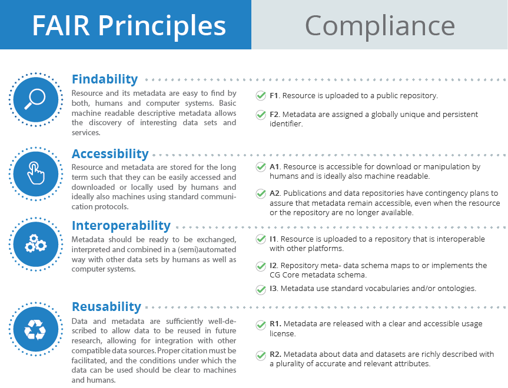](img/fair.png)
:::

::::


:::footer
[Wilkinson *et al.* 2016. *The FAIR Guiding Principles for scientific data management and stewardship*](https://www.nature.com/articles/sdata201618)
:::


## [FAIR](https://www.nature.com/articles/sdata201618) Principles

***Persistent Identifiers (PIDs)***

::: {style="font-size: 80%;"}
- What they are: unique, permanent digital references for research objects, people, and institutions.  

- Examples:  
  - **DOI** ➡️ datasets, publications  
  - **ORCID** ➡️ researchers  
  - **ROR** ➡️ institutions  
  - **ARK / Handle** ➡️ digital objects  

- Why are PIDs important for DMPs & RDM?
  - Ensure long-term findability and access  
  - Enable unambiguous attribution (linking people, projects, data)  
  - Facilitate interoperability across repositories and systems  
  - Support impact tracking and reuse metrics  

*Think of PIDs as the “barcodes” of research*  
:::


## [TRUST](https://datascience.codata.org/articles/10.5334/dsj-2020-043/) Principles

:::: {.columns}

::: {.column width="50%"}
::: {style="font-size: 80%;"}
- `(T)` Transparency 
- `(R)` Responsibility
- `(U)` User Focus
- `(S)` Sustainability
- `(T)` Technology
:::
:::

::: {.column width="50%"}
[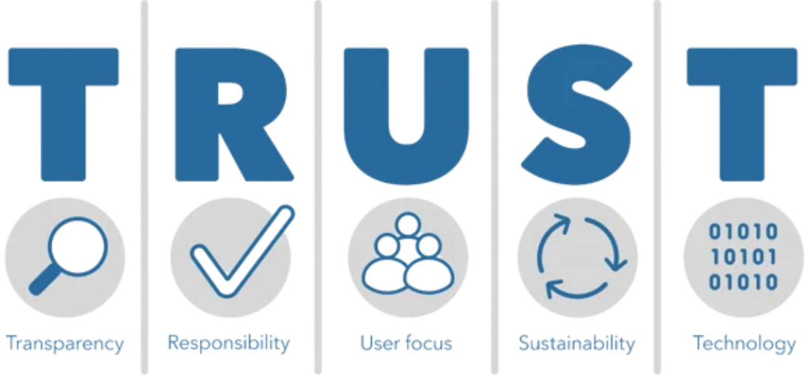](img/trust.png)
:::

::::

::: {style="font-size: 80%;"}
**Goals:**

- Build confidence in digital repositories  
- Ensure authenticity, integrity, and reliability of data  
- Prioritize the needs of user communities  
- Guarantee long-term preservation and accessibility  
- Provide secure, persistent, and interoperable infrastructure  
:::

:::footer
[Lin *et al.* 2020. *The TRUST Principles for digital repositories* Scientific data](https://www.nature.com/articles/s41597-020-0486-7)
:::


## Borealis


:::: {.columns}

::: {.column width="60%"}
::: {.callout-tip}

OCUL = Ontario Council of University Libraries
::: 

> In Canada, Borealis is a national instance of the Dataverse repository hosted by OCUL's Scholars Portal at the University of Toronto.


:::

::: {.column width="40%"}

[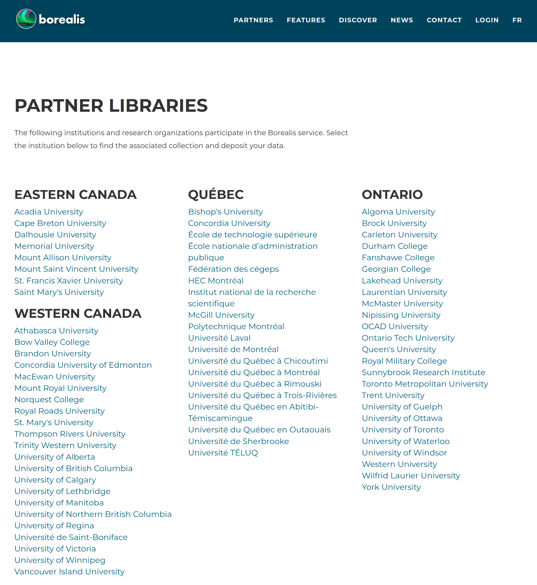](img/borealis_partners.png)

::: 

::::


:::footer 
[Dataverse](https://dataverse.org) 
&nbsp; ***·*** &nbsp;
[Borealis](https://borealisdata.ca/)
&nbsp; ***·*** &nbsp;
[Brealis at Université Laval](https://borealisdata.ca/dataverse/laval)
:::


## Licensing Your Data

- A license tells others how they can use your data
- Common choices:  
  - **CC-BY** ➡️ use with attribution  
  - **CC0** ➡️ no restrictions (public domain)  
  - **Custom agreements** ➡️ for sensitive, Indigenous, or commercial data  

*Clearly state the license in your metadata, README, or repository record*

:::footer
[Creative Commons Licenses](https://creativecommons.org/licenses/)
&nbsp; ***·*** &nbsp;
[Data Management Expert Guide](https://dmeg.cessda.eu/Data-Management-Expert-Guide/6.-Archive-Publish/Publishing-with-CESSDA-archives/Licensing-your-data)
&nbsp; ***·*** &nbsp;
[How to FAIR](https://www.howtofair.dk/how-to-fair/data-licences)
&nbsp; ***·*** &nbsp;
[Nature Portfolio policy](https://support.nature.com/en/support/solutions/articles/6000237622-select-the-right-licence-for-your-data)
:::


## Ethical and Legal aspects 


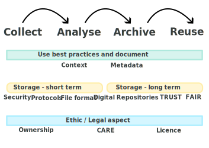{width=86%, fig-align="center"}


## With Borealis 

- You are using a TRUST platform that respects FAIR principles
- You will have to fill out metadata and proper standard will be used
- The archiving portion of the DMP is hence taken care of


## [CARE](https://datascience.codata.org/articles/10.5334/dsj-2020-043/) Principles

:::: {.columns}

::: {.column width="60%"}
::: {style="font-size: 80%;"}
- `(C)` Collective Benefit
- `(A)` Authority to Control
- `(R)` Responsibility
- `(E)` Ethics

**Goals:**

- People- and purpose-oriented
- First Nations data rights and governance
- Inspired from [OCAP®](https://fnigc.ca/ocap-training/)
- Complement FAIR Principles
:::
:::

::: {.column width="40%"}
[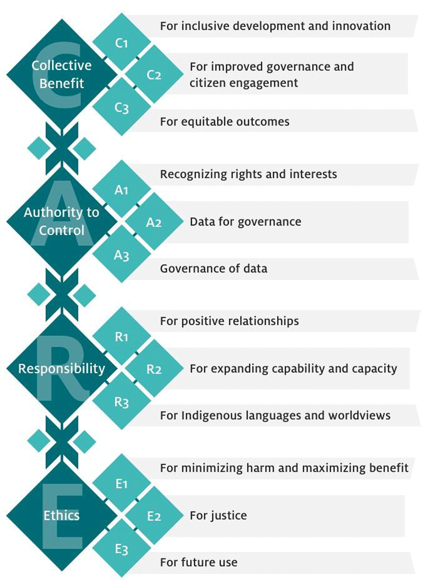](img/care.png)
:::

::::


:::footer
[Russo Carroll *et al.* 2020. *The CARE Principles for Indigenous Data Governance*](https://datascience.codata.org/articles/10.5334/dsj-2020-043/)
:::


## Anticipate 

:::: {.columns}

::: {.column width="60%"}

- Think about all of this process before doing it 

::: {.fragment}
- Write a DMP! 

::: {.callout-tip}
### DMP: Data Management Plan
:::


::: {.fragment}
- Could be relatively quick 

::: 
:::

:::

::: {.column width="40%"}
{width=100%, fig-align="center"}
:::


::::


# Organisational considerations


## RDM in IRPs

:::: {.columns}

::: {.column width="60%"}

::: {.callout-tip}
### IRP: Interdisciplinary Research Program
:::

::: {.incremental .small}
- **Scale & complexity**: multiple projects, teams, and disciplines 
- **Continuity**: long program lifespans require robust preservation  
- **Opportunities**: well-managed data fosters reuse, integration, new collaborations and new insights  
:::


:::

::: {.column width="40%"}
{width=100%, fig-align="center"}

::: {.small}
- Same process x number of projects!
- Efforts required in coordination
:::
:::

::::


## ArcticNet Principles

***In other words: what is expected of you as a researcher***


::: {style="font-size: 80%;"}
:::{.incremental}
- ArcticNet funded data = a **public good** ➡️ as open as possible, as closed as necessary  
- Researchers must ensure:  
  - **Timely sharing** ➡️ data made publicly available quickly, unless restricted 
  - **Publish metadata** ➡️ publish and share your metadata (e.g. Polar Data Catalog)
  - **Respect for Indigenous rights** ➡️ uphold Inuit, First Nations, and Métis ownership, access, and control (CARE, OCAP®, NISR)  
  - **Citable & preserved** ➡️ data should be publishable, citable, and preserved when appropriate  
  - **Interoperability & connectivity** ➡️ link with Canadian & international Arctic data systems, avoid duplication  
  - **Best practices** ➡️ follow ethical, legal, cultural, and funder requirements; use existing infrastructure where possible  
  - **Support & guidance** ➡️ researchers engage with training, outreach, and resources provided  
:::
:::

:::footer
[ArcticNet Data Management Policy (2025)](https://arcticnet.ca/wp-content/uploads/2025/03/ArcticNet-Data-Management-Policy-ADMP_Approved-March-2025.pdf)
:::


## Tri-Agency RDM Policy (2021)

- **Applies across NSERC, SSHRC, CIHR**  
- Institutions must develop and publish **institutional RDM strategies**  
- Researchers are expected to:  
  - Prepare and maintain **Data Management Plans**  
  - Deposit data in **trusted repositories** when appropriate  
- Ensures Canadian research aligns with **international open science practices**  
- Compliance increasingly linked to **funding requirements**  

:::footer
[Tri-Agency RDM Policy](https://science.gc.ca/site/science/en/interagency-research-funding/policies-and-guidelines/research-data-management/tri-agency-research-data-management-policy-frequently-asked-questions)
:::


## Timeline and dual responsibilities

*Network: balance autonomy & coordination*

:::: {.columns}
::: {.column width="40%"}
- Standards & templates
- Tools for metadata & discovery
- Review, feedback & training
- Synthesize & report
:::

::: {.column width="60%"}
[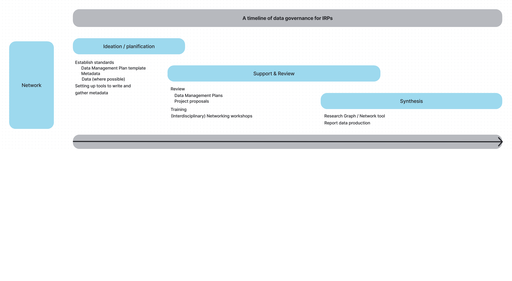{width=100%}](img/timeline2.png)
:::
::::

## Timeline and dual responsibilities

*Researchers: manage and document project data responsibly*

:::: {.columns}
::: {.column width="40%"}
- Proposal & tentative data management plan
- Develop and maintain project-level data management plan
- Collect & document
- Analyze
- Archive
:::

::: {.column width="60%"}
[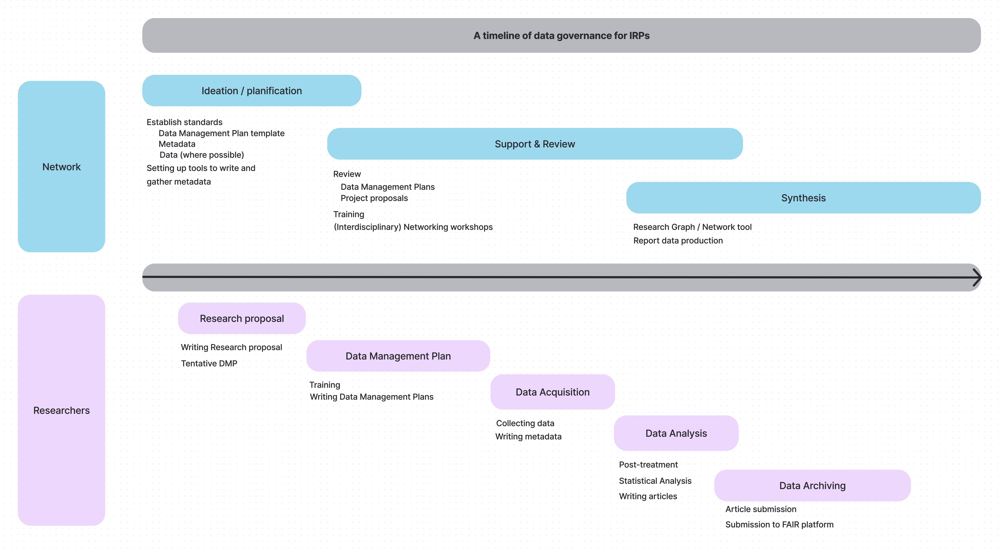{width=100%}](img/timeline2.png)
:::
::::
 

