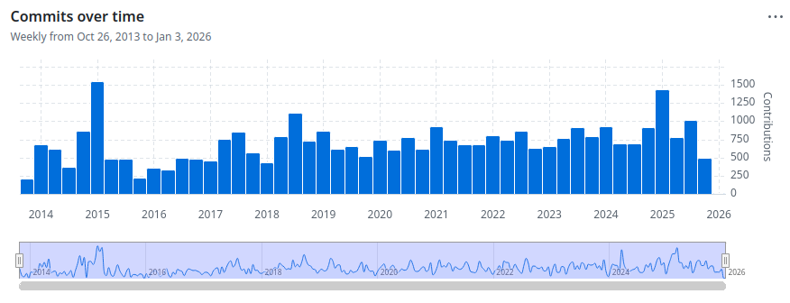
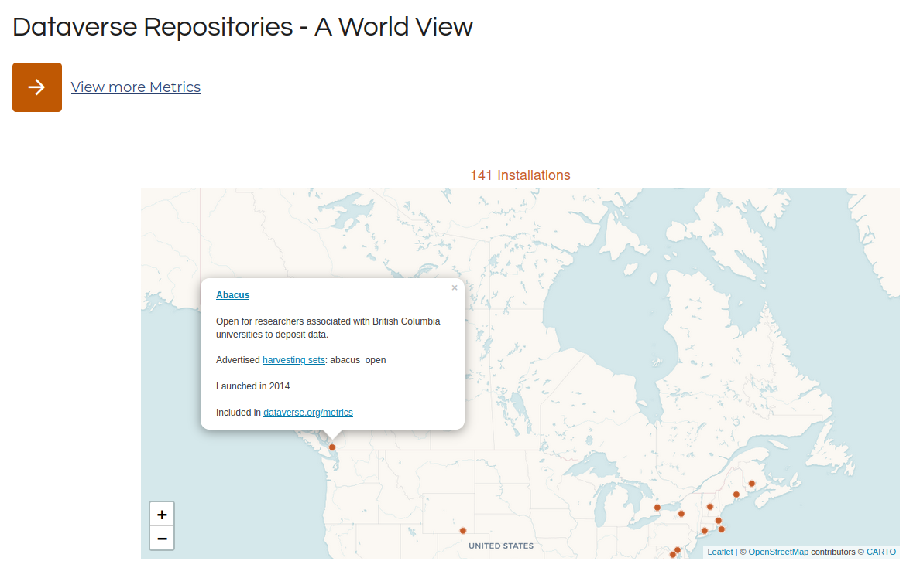
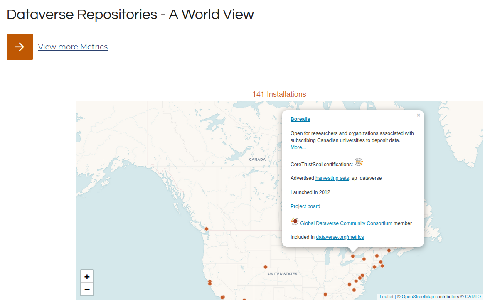
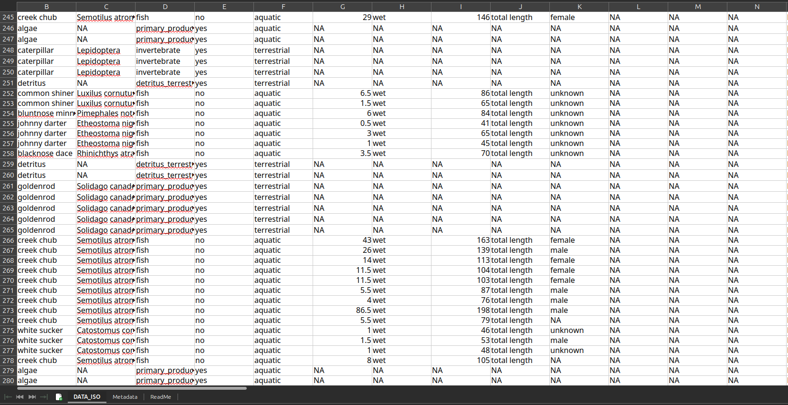
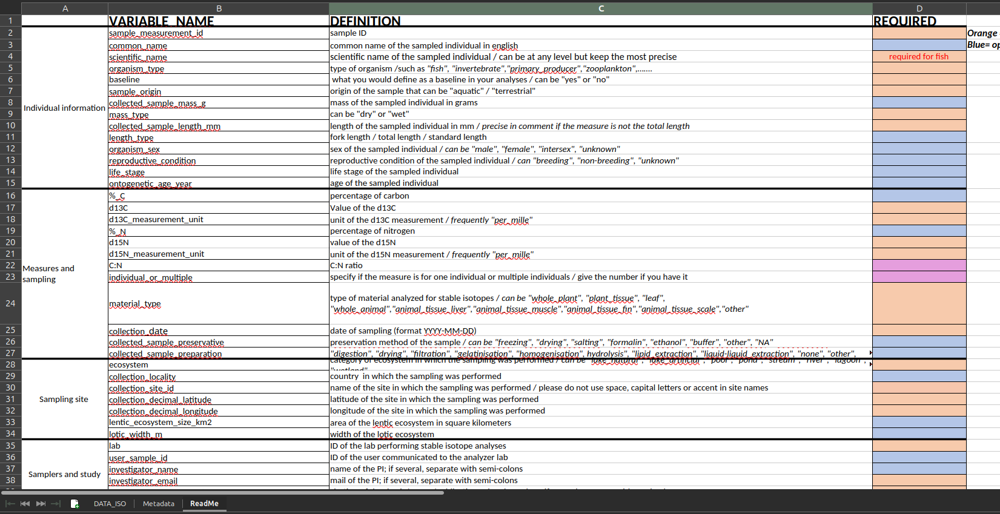

# About us 


## About us

::: {style="text-align: center;"}
[{width=80%}](https://insileco.io/){target="_blank"}
:::

## About us 

***inSileco*** & ***ArcticNet*** **(since 2023)**

- Develop criteria for project Data Management
- Review and provide feedback on project Data Management Plans
- Support researchers with RDM practices and tools
- Maintain and expand ArcticNet’s long-term data archive
- Deliver training and capacity building (e.g. this webinar)


## Webinar Structure  

<br>

1. ***Context***
2. ***Workflow***
3. ***Practice: let's draft your DMP*** 
4. ***Future*** 
6. ***Q&A*** 


# Context

RDM, Data & Open Science


## Research data  

::: {.fragment}

- Researchers transform facts into knowledge 
  - collect, analyze and archive research data

:::

:::{.fragment}

- Broad definitions: 
  - recorded information supporting research findings
  - information in a form that can be processed
    - structured collection of bits
:::


## What is RDM?

::: {.callout-tip}
### RDM: Research Data Management
:::

- **Active management** of **research data**
- Includes planning, documentation, storage, sharing  
- Encompasses both **technical practices** and **governance**


:::footer
[McGill video capsule](https://www.youtube.com/watch?v=Jm7qIkrL3wM)
&nbsp; ***·*** &nbsp;
[Tri-Agency RDM Policy](https://science.gc.ca/site/science/en/interagency-research-funding/policies-and-guidelines/research-data-management/tri-agency-research-data-management-policy-frequently-asked-questions)
&nbsp; ***·*** &nbsp;
[Digital Curation Centre](https://www.dcc.ac.uk/guidance/curation-lifecycle-model)
:::


## Research data are getting bigger 

:::: {.columns}

::: {.callout-tip }
### GBIF: Global Biodiversity Information Facility
:::

::: {.column width="50%"}
- Powerful technologies enabling unprecedented data collection
- Ex: GBIF
  - 125 million records in 2007 
  - 1.6 billion in 2020
  - **1 150% increase in just 13 years**
:::

::: {.column width="50%"}
[{width=100%}](img/bigData.png)
:::

:::: 

> A modern LLM is typically trained with 1x10^13 two-byte tokens, which is 2x10^13 bytes.

Yann Lecun, X, 2024


:::footer 
&nbsp; ***·*** &nbsp;
[Clissa *et al.* 2023. *How big is Big Data?* Frontiers in Big Data](https://www.frontiersin.org/journals/big-data/articles/10.3389/fdata.2023.1271639/full)
&nbsp; ***·*** &nbsp;
[Mason *et al.* 2021. *Data integration enables global biodiversity synthesis* PNAS](https://www.pnas.org/doi/10.1073/pnas.2018093118)
:::


## Research data are heterogeneous

:::: {.columns}

::: {.column width="70%"}
- New research questions, new data 
- Different objects, storage formats, technologies  
- Data vary widely across and within disciplines  
- One research handle a wide array of type of data 
:::

::: {.column width="30%"}
[{width=100%}](img/variety-of-big-data-sources.png)
:::

:::: 

:::footer
[ColumnFive Media](https://www.columnfivemedia.com/work/infographic-intelligence-by-variety)
:::


## Research data are valuable


- We need reliable data to better understand and predict
  - anticipate/mitigate future changes
  - Ex: good assessment of temperature and precipitation change
- Some data are hard (and expansice) to collect
  - Arctic Data are good examples
- Data are **precious** for future generations
  - We cannot collect past data
  - past public money has been spent to collect them


## So,

- Research data are big and heterogenous 
- Research data are extremely valuable 

:::{.fragment}
### Let's take good care of all collected datasets
:::


# Workflow 

## Typical data workflow 


## Collect 

- Use the best protocp


## Analyse 

- Should tramsformed adta 
- Should I share the code 
- Github -> Code 
- If I give you the code and the raw data you should 
  - if it takes 10 days on your local computer.... 


## Archive 


## Reuse 

- You and other 
- Secondary data 


## Why this matters for you

::: {.callout-tip}
### IRP: Interdisciplinary Research Program
:::

- Data is a **primary research output**  
- Reduces risk of **data loss or inaccessibility**  
- Proper management increases **visibility & citations**  
- Strengthens **compliance** with funders & journals  
- Builds a foundation for **collaboration in IRPs**
  - data may be reused in unexpected ways by colleagues


## Why this matters for you

::: {.callout-tip}
### IRP: Interdisciplinary Research Program
:::

- Data is now a **primary research output**  
- Reduces risk of **data loss or inaccessibility**  
- Proper management increases **visibility & citations**  
- Strengthens **compliance** with funders & journals  
- Builds a foundation for **collaboration in IRPs**
  - data may be reuse in unexpected ways by colleagues


<!-- ~~~~~~~~~~~~~~~~~~~~~~~~~~~~~~~~~~~~~~~~~~~~~~~~~~~~~~~~~~~~~~~~~~~~~~~~~~~~~~~~~~~~~~~~~~~~~~~~~~~~~~~~~~~~~~~~~~~~ -->
# *What*

Definition, Policies & Benefits


## Benefits of RDM

- Greater **visibility & citations** for datasets  
- Reduced **risk of loss** (backups, repositories)  
- Stronger **collaboration & integration** across teams and institutions  
- Improved **efficiency** via organized workflows  
- Network-level governance fosters **new synergies**  
- Enhanced **credibility & compliance** with funders  

## RDM in IRPs

- **Scale & complexity**: multiple projects, teams, and disciplines  
- **Heterogeneity**: diverse data types, methods, and formats  
- **Collaboration**: shared datasets across institutions & regions  
- **Continuity**: long program lifespans require robust preservation  
- **Accountability**: funder compliance + community expectations  
- **Opportunities**: well-managed data fosters reuse, integration, and new insights  


## Tri-Agency RDM Policy (2021)

- **Applies across NSERC, SSHRC, CIHR**  
- Institutions must develop and publish **institutional RDM strategies**  
- Researchers are expected to:  
  - Prepare and maintain **Data Management Plans**  
  - Deposit data in **trusted repositories** when appropriate  
- Ensures Canadian research aligns with **international open science practices**  
- Compliance increasingly linked to **funding requirements**  

:::footer
[Tri-Agency RDM Policy](https://science.gc.ca/site/science/en/interagency-research-funding/policies-and-guidelines/research-data-management/tri-agency-research-data-management-policy-frequently-asked-questions)
:::

## ArcticNet’s Policy (2025)

::: {.callout-note}
### More details available in the *How to Guide* 
:::

**Objectives**:  

- Apply best practices in data stewardship (national & international standards)  
- Maximize value through accessibility, reuse, and transparency
- Encourage collaboration and responsible data sharing
- Provide guidance for sensitive data
- Respect Indigenous data sovereignty


:::footer
[ArcticNet Data Management Policy (2025)](https://arcticnet.ca/wp-content/uploads/2025/03/ArcticNet-Data-Management-Policy-ADMP_Approved-March-2025.pdf)
:::


<!-- ~~~~~~~~~~~~~~~~~~~~~~~~~~~~~~~~~~~~~~~~~~~~~~~~~~~~~~~~~~~~~~~~~~~~~~~~~~~~~~~~~~~~~~~~~~~~~~~~~~~~~~~~~~~~~~~~~~~~ -->
# *When & Who*

Timeline, Roles & Responsibilities


## Why timing matters in IRPs

- IRPs = distributed ecosystems ➡️ diverse goals, methods, and data practices  
- Effective RDM must start early and continue throughout the program  
- Early planning unlocks future reuse & collaboration
- Data as an infrastructure for collaboration


## Timeline and dual responsibilities

*Network: balance autonomy & coordination*

:::: {.columns}
::: {.column width="40%"}
- Standards & templates
- Tools for metadata & discovery
- Review, feedback & training
- Synthesize & report
:::

::: {.column width="60%"}
[{width=100%}](img/timeline2.png)
:::
::::

## Timeline and dual responsibilities

*Researchers: manage and document project data responsibly*

:::: {.columns}
::: {.column width="40%"}
- Proposal & tentative data management plan
- Develop and maintain project-level data management plan
- Collect & document
- Analyze
- Archive
:::

::: {.column width="60%"}
[{width=100%}](img/timeline2.png)
:::
::::
 


## Benefits of shared responsibility

- **For Researchers**  
  - Reduced administrative burden (network reviews, templates, tools)  
  - Increased visibility and citations for datasets  
  - Easier compliance with funder requirements  
  - Improved data reuse and discovery  
  - Unexpected collaborations & new insights  

## Benefits of shared responsibility

- **For Researchers**  
  - Reduced administrative burden (network reviews, templates, tools)  
  - Increased visibility and citations for datasets  
  - Easier compliance with funder requirements  
  - Improved data reuse and discovery  
  - Unexpected collaborations & new insights  

- **For the Network & IRP**  
  - Better integration of diverse datasets  
  - Ability to track collaboration & impact  
  - Stronger collective legacy beyond the program  
  - Data infrastructure that supports future research  

## ArcticNet Principles

***In other words: what is expected of you as a researcher***


::: {style="font-size: 80%;"}
:::{.incremental}
- ArcticNet funded data = a **public good** ➡️ as open as possible, as closed as necessary  
- Researchers must ensure:  
  - **Timely sharing** ➡️ data made publicly available quickly, unless restricted 
  - **Publish metadata** ➡️ publish and share your metadata (e.g. Polar Data Catalog)
  - **Respect for Indigenous rights** ➡️ uphold Inuit, First Nations, and Métis ownership, access, and control (CARE, OCAP®, NISR)  
  - **Citable & preserved** ➡️ data should be publishable, citable, and preserved when appropriate  
  - **Interoperability & connectivity** ➡️ link with Canadian & international Arctic data systems, avoid duplication  
  - **Best practices** ➡️ follow ethical, legal, cultural, and funder requirements; use existing infrastructure where possible  
  - **Support & guidance** ➡️ researchers engage with training, outreach, and resources provided  
:::
:::

:::footer
[ArcticNet Data Management Policy (2025)](https://arcticnet.ca/wp-content/uploads/2025/03/ArcticNet-Data-Management-Policy-ADMP_Approved-March-2025.pdf)
:::


## Documentation & metadata  

***What are metadata & metadata standards?***  

::: {style="font-size: 80%;"}  
- Define how datasets are described (the context, not the content)  
- Ensure data are findable, interpretable, and reusable  
- Provide consistent fields for *who, what, where, when, how* 
- Examples:  
  - **Dublin Core** ➡️ general-purpose descriptors  
  - **ISO 19115** ➡️ geospatial metadata  
  - **Darwin Core** ➡️ biodiversity metadata  
  - **DataCite Schema** ➡️ dataset metadata for DOIs  
:::  

::: {.callout-note}  
### Metadata standards vs Data standards  
Metadata standards describe the data itself (context & discovery), while data standards define how the data is structured. Together, they ensure interoperability and reuse.  
:::  


:::footer  
[FAIRsharing.org](https://fairsharing.org/)  
:::


## Documentation & metadata  


***Dublin Core: What is it?***

- A **generic metadata standard** used across disciplines  
- Provides a **basic set of 15 elements** to describe digital objects  
- Focused on: **who, what, where, when**  
- Works across repositories, making datasets **findable and shareable**  

**Core elements (examples):**  
- `title`, `creator`, `subject`, `date`, `format`, `identifier`  

💡 Often extended with qualifiers to add more precision  

## Documentation & metadata  


***Dublin Core: The Grammar***

- Based on **element–value pairs**  
  - Element = the property being described  
  - Value = the information recorded  
- Syntax is **machine-readable** (XML, JSON) but also **human-readable**  
- Flexible: can be embedded in repositories, DOIs, web pages  

**Example pattern:**  
- `dc:title` ➡️ "Water Sampling Data 2025"  
- `dc:creator` ➡️ "Smith, J."  
- `dc:date` ➡️ "2025-04-15"  

## Documentation & metadata  


***Dublin Core: Example Record***

```xml
<record>
  <dc:title>Water Sampling Data 2025</dc:title>
  <dc:creator>Smith, J.</dc:creator>
  <dc:subject>Oceanography</dc:subject>
  <dc:date>2025-04-15</dc:date>
  <dc:format>CSV</dc:format>
  <dc:identifier>doi:10.12345/abcd</dc:identifier>
</record>
```

## Preservation & archiving


***Persistent Identifiers (PIDs)***

::: {style="font-size: 80%;"}
- What they are: unique, permanent digital references for research objects, people, and institutions.  

- Examples:  
  - **DOI** ➡️ datasets, publications  
  - **ORCID** ➡️ researchers  
  - **ROR** ➡️ institutions  
  - **ARK / Handle** ➡️ digital objects  

- Why are PIDs important  DMPs & RDM?
  - Ensure long-term findability and access  
  - Enable unambiguous attribution (linking people, projects, data)  
  - Facilitate interoperability across repositories and systems  
  - Support impact tracking and reuse metrics  

*Think of PIDs as the “barcodes” of research*  
:::

## Preservation & archiving


***Data repositories***

- Institutional ➡️ university libraries, research data services  
- National ➡️ Federated Research Data Repository (FRDR), Borealis
- Disciplinary ➡️ GBIF, OBIS, GenBank, ICPSR  
- General-purpose ➡️ Zenodo, Dryad, Figshare, Dataverse

***Choose a repository that is:***

- Trusted (certified, long-term sustainability)  
- FAIR and TRUST-aligned (metadata standards, PIDs)  
- Appropriate for your data type & community  

:::footer
[Repository Finder (re3data.org)](https://www.re3data.org/)
&nbsp; ***·*** &nbsp;
[FRDR](https://www.frdr-dfdr.ca/)
&nbsp; ***·*** &nbsp;
[FAIRsharing.org](https://fairsharing.org/)
&nbsp; ***·*** &nbsp;
[Dataverse](https://dataverse.org/)
:::


# Borealis

## [Dataverse](https://dataverse.org)

> A collaboration with the Institute for Quantitative Social Science (IQSS), the Harvard Library, and Harvard University Information Technology (HUIT): the Harvard Dataverse is a repository for sharing, citing, analyzing, and preserving research data. It is open to all scientific data from all disciplines worldwide. 

- 💻 <https://github.com/IQSS/dataverse>

[{width=50%}](img/borealis_commits.png)

:::footer 
<https://en.wikipedia.org/wiki/Dataverse>
:::


## Two Canadian installations

:::: {.columns}

::: {.column width="50%"}

### [Abascus](https://abacus.library.ubc.ca/)

[](img/borealis_abascus.png)

:::

::: {.column width="50%"}

### [Borealis](https://borealisdata.ca/)

[](img/borealis_toronto.png)

:::

::::

## [Borealis](https://borealisdata.ca/)

::: {.callout-tip}
OCUL = Ontario Council of University Libraries
::: 

> In Canada, Borealis is a national instance of the Dataverse repository hosted by OCUL's Scholars Portal at the University of Toronto.

- Support at Guelph at UoG library.
- CEM repository: <https://borealisdata.ca/dataverse/cem>


## With Borealis 

- You are using a TRUST platform that respects FAIR principles
- You will have to fill out metadata and proper standard will be used
- The archiving portion of the DMP is hence taken care of

- Example: <https://borealisdata.ca/dataverse/doib>
- Resources
  - [Template](https://borealisdata.ca/dataset.xhtml?persistentId=doi:10.5683/SP2/CPHFGA)
  - [Writing README](https://guides.lib.uoguelph.ca/c.php?g=738963&p=5374594)


## From local spreadsheet to FAIR datasets

[](img/borealis_spreadsheet1.png)


## From local spreadsheet to FAIR datasets

[](img/borealis_spreadsheet2.png)


## Sharing & reuse


***Licensing Your Data***

- A license tells others how they can use your data
- Common choices:  
  - **CC-BY** ➡️ use with attribution  
  - **CC0** ➡️ no restrictions (public domain)  
  - **Custom agreements** ➡️ for sensitive, Indigenous, or commercial data  

*Clearly state the license in your metadata, README, or repository record*

:::footer
[Creative Commons Licenses](https://creativecommons.org/licenses/)
&nbsp; ***·*** &nbsp;
[Data Management Expert Guide - Licensing your data](https://dmeg.cessda.eu/Data-Management-Expert-Guide/6.-Archive-Publish/Publishing-with-CESSDA-archives/Licensing-your-data)
&nbsp; ***·*** &nbsp;
[How to FAIR - Data licences](https://www.howtofair.dk/how-to-fair/data-licences)
&nbsp; ***·*** &nbsp;
[Choose a license](https://choosealicense.com/licenses/)
:::

