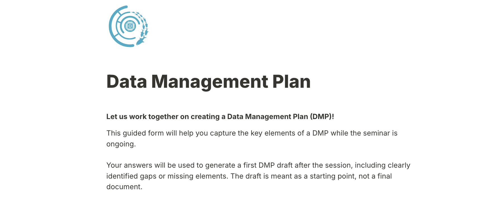
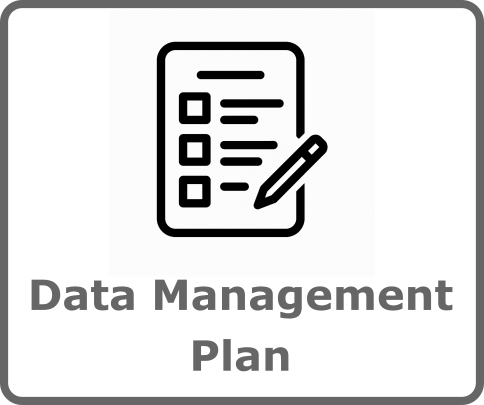
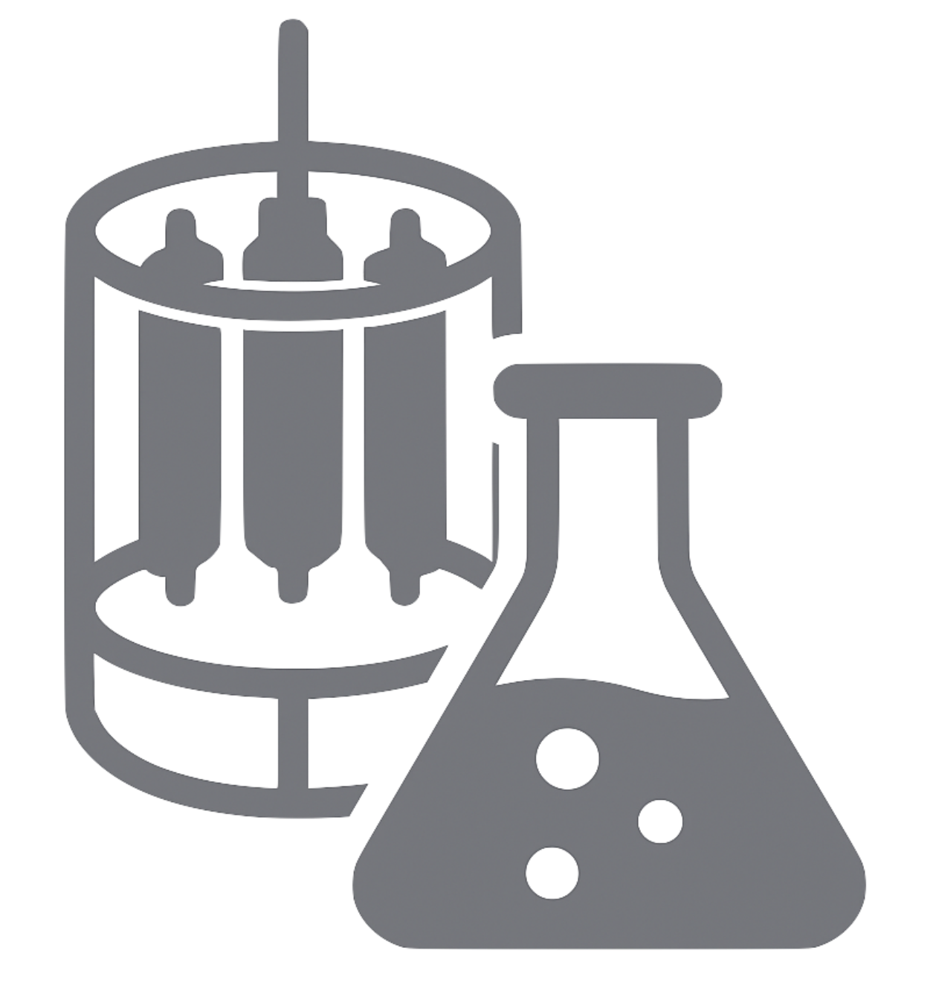
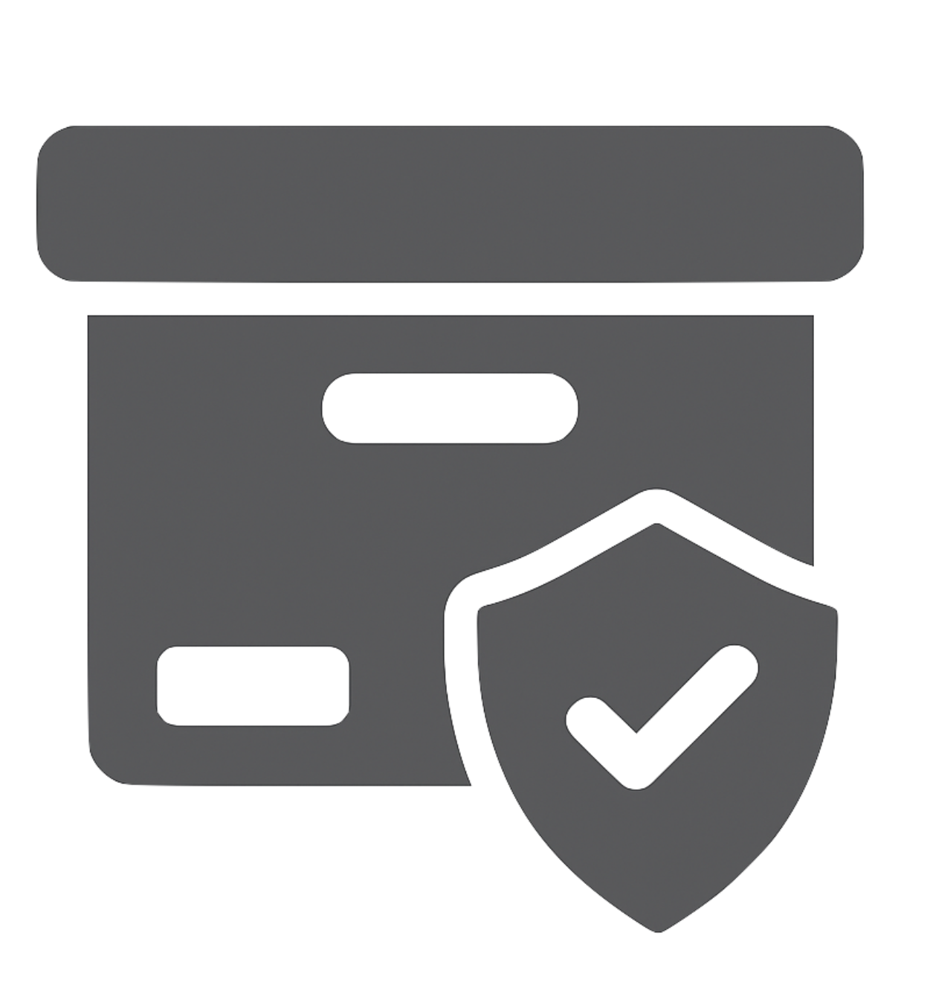
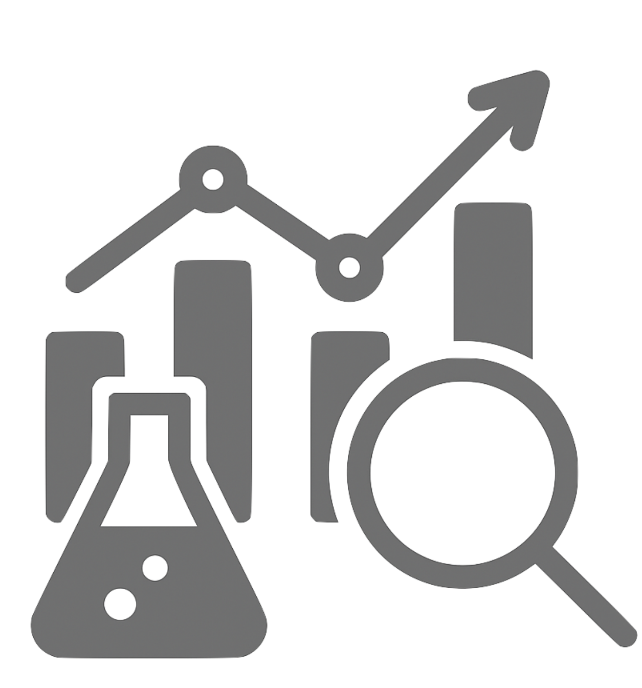
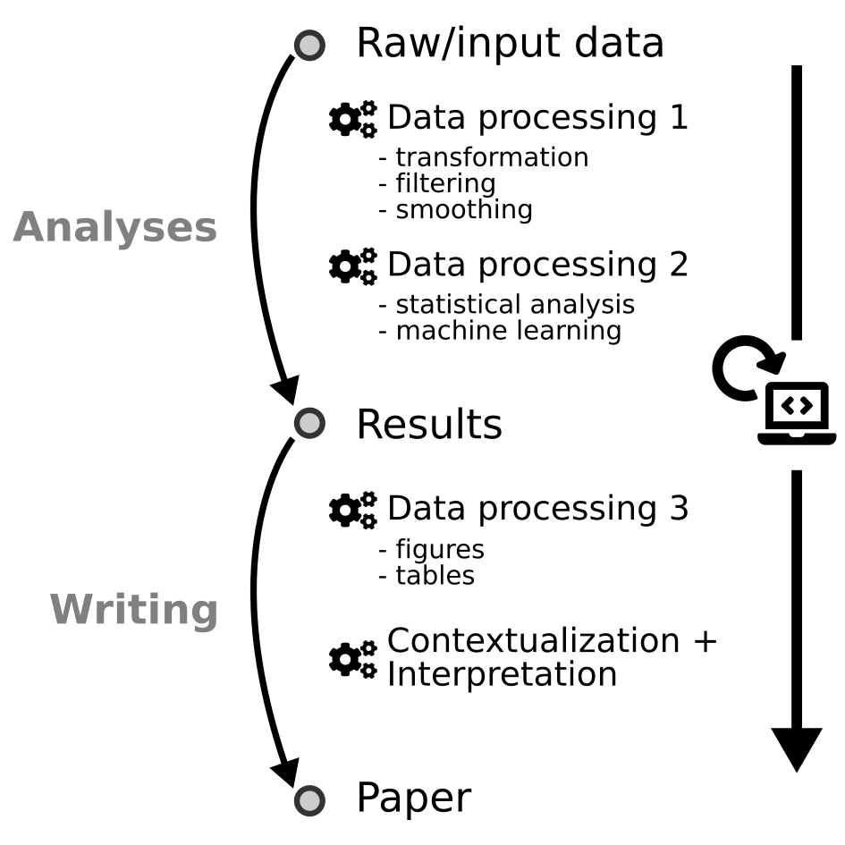
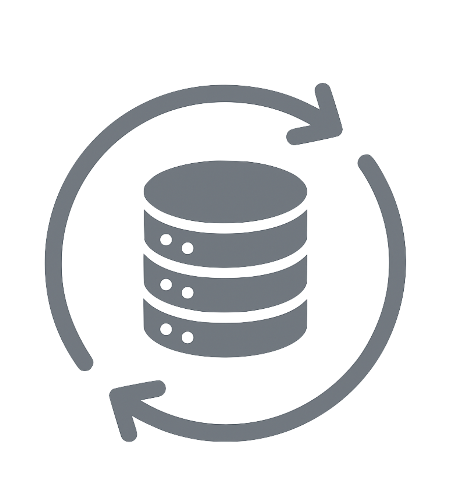
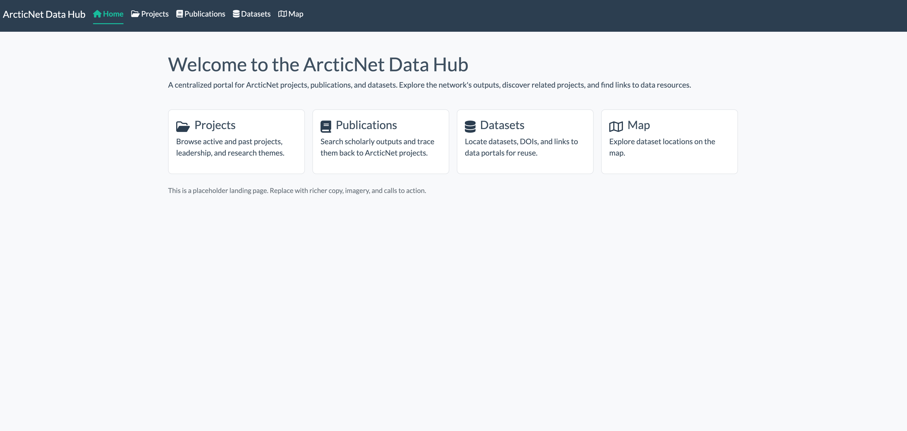
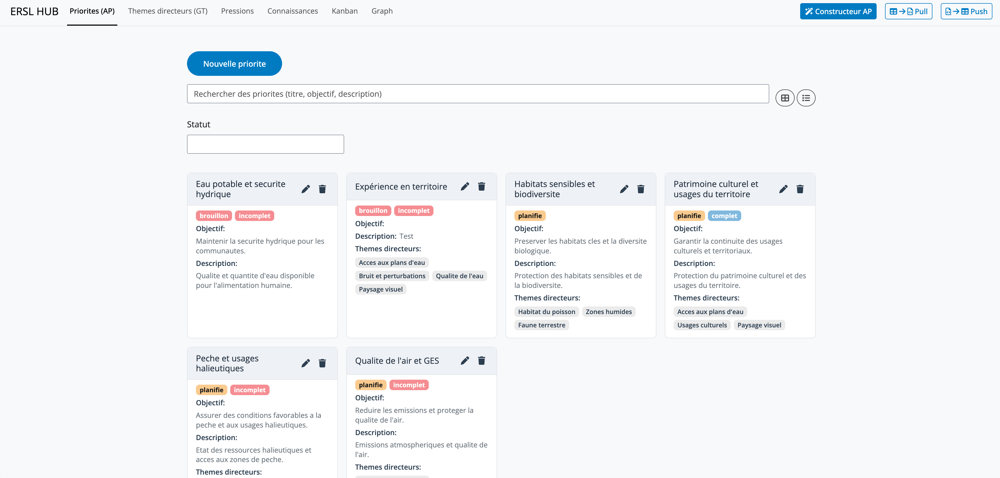
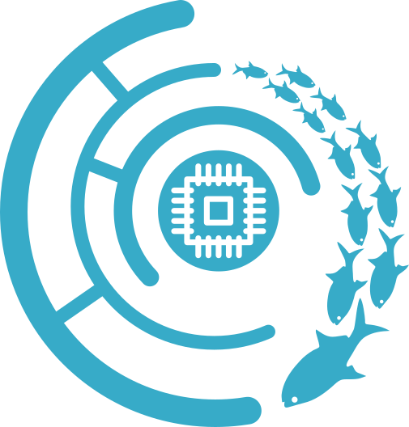

<!-- ~~~~~~~~~~~~~~~~~~~~~~~~~~~~~~~~~~~~~~~~~~~~~~~~~~~~~~~~~~~~~~~~~~~~~~~~~~~~~~~~~~~~~~~~~~~~~~~~~~~~~~~~~~~~~~~~~~~~ -->
# *How to Guide*

Building your Data Management Plan

<!-- ~~~~~~~~~~~~~~~~~~~~~~~~~~~~~~~~~~~~~~~~~~~~~~~~~~~~~~~~~~~~ -->

## What is a DMP?

::: {.callout-tip}
### DMP: Data Management Plan
:::

> A Data Management Plan (DMP) is a formal document, typically 1-2 pages long, that outlines how data will be handled during and after a project.  

:::footer
[McGill video capsule](https://www.youtube.com/watch?v=p_JzQxxC4ts)
&nbsp; ***·*** &nbsp;
[Harvard guide](https://datamanagement.hms.harvard.edu/plan-design/data-management-plans)
&nbsp; ***·*** &nbsp;
[DMP Assistant templates](https://dmp-pgd.ca/public_templates)
:::

## What is a DMP?

::: {.callout-tip}
### DMP: Data Management Plan
:::

***Benefits:***

::: {style="font-size: 80%;"}
:::{.incremental}
- Required by many funders, including Tri-Agency 
- Ensures feasibility of research proposals  
- Demonstrates responsible stewardship of public funds  
- Sets expectations for storage, sharing, and preservation  
- Foundation for good collaboration and reuse 
- Easier compliance with certain journals
- Improved visibility and citations for datasets  
:::
:::

:::footer
[McGill video capsule](https://www.youtube.com/watch?v=p_JzQxxC4ts)
&nbsp; ***·*** &nbsp;
[Harvard guide](https://datamanagement.hms.harvard.edu/plan-design/data-management-plans)
&nbsp; ***·*** &nbsp;
[DMP Assistant templates](https://dmp-pgd.ca/public_templates)
:::

## Why DMPs matter in IRPs

- IRPs = **distributed ecosystems** ➡️ diverse goals, data, practices  
- Collective DMPs give **visibility** into expected outputs  
- Enable **early coordination** of standards and tools  
- Reveal **overlaps, synergies, and cost-sharing opportunities**  
- Reduce duplication and improve program coherence  

## Key sections of a DMP

:::{.callout-tip}
### Answer these questions **with substance** and you will have a complete DMP:  
:::

::: {style="font-size: 80%;"}
::: {.incremental}
1. <i class="fa-regular fa-circle"></i> **Data collection** ➡️ What data, formats, volume, protocols?  
2. <i class="fa-regular fa-circle"></i> **Documentation & metadata** ➡️ How will data be described? Which standards?  
3. <i class="fa-regular fa-circle"></i> **Storage & protection** ➡️ Where will working data live, and how is it protected?  
4. <i class="fa-regular fa-circle"></i> **Data Analysis** ➡️ How will the data be analyzed? 
5. <i class="fa-regular fa-circle"></i> **Preservation & archiving** ➡️ Which repository, which formats for long-term?  
6. <i class="fa-regular fa-circle"></i> **Sharing & reuse** ➡️ Who can access it, when, under what license?  
7. <i class="fa-regular fa-circle"></i> **Legal & ethics** ➡️ How are legal, privacy, consent, Indigenous data rights addressed?
:::
:::

## Tools and templates

- Use available tools if possible
  - [DMP Assistant](https://dmp-pgd.ca/) (Canada’s online tool)  
  - [DMP Tool](https://dmptool.org/)
- Network may provide a **template** tailored to your program  
- Examples and guidance available from:  
  - [Harvard DMP resources](https://datamanagement.hms.harvard.edu/plan-design/data-management-plans)  
  - [McGill videos](https://www.youtube.com/watch?v=p_JzQxxC4ts)  

## Good practices

:::{.callout-tip}
### DMP Tips

:::{.incremental}
- **Start early** ➡️ draft DMP in the proposal stage  
- Treat it as a **living document** ➡️ update as project evolves  
- Reuse existing metadata forms / standards where possible (more on this later)
- Keep it concise but **actionable**  
- Align with **FAIR, CARE & TRUST** principles
:::
:::

<!-- ~~~~~~~~~~~~~~~~~~~~~~~~~~~~~~~~~~~~~~~~~~~~~~~~~~~~~~~~~~~~ -->

# Practical Guide 

## Goal

 

***Equip researchers with concrete steps to manage data responsibly, efficiently, and in line with network & funder expectations.***

 

***At the end, you should know what steps to undertake to prepare and update an adequate Data Management Plan***

## Goal 

***Let us create a DMP together. Let's start [here](https://tally.so/r/QKekoX).***

## Checklist

::: {style="font-size: 90%;"}
<i class="fa-regular fa-circle"></i> *Data collection*

<i class="fa-regular fa-circle"></i> *Documentation & metadata*

<i class="fa-regular fa-circle"></i> *Storage & protection*

<i class="fa-regular fa-circle"></i> *Data Analysis*

<i class="fa-regular fa-circle"></i> *Preservation & archiving*

<i class="fa-regular fa-circle"></i> *Sharing & reuse*

<i class="fa-regular fa-circle"></i> *Legal & ethics*

:::

<!--
{width=20%} 
{width=20%}
{width=20%} 
-->

<!-- ~~~~~~~~~~~~~~~~~~~~~~~~~~~~~~~~~~~~~~~~~~~~~~~~~~~~~~~~~~~~ -->
# Data collection 

  

## Data collection

***Guiding Questions***

::: {style="font-size: 80%;"}
- What kinds of data will I collect?
  - *observational, experimental, computational, derived*
- Which instruments, sensors, or methods will I use? 
  - *field protocols, sensors, lab assays, software pipelines*
- How will I ensure quality control before, during, and after collection?  
  - *calibration, duplicate samples, error-checking*
- How will I organize and label files?  
  - *consistent file/folder naming, controlled vocabularies*
:::

## Data collection

***Quality Assurance / Quality Control (QA/QC)***

::: {style="font-size: 80%;"}
- **Before collection** ➡️ instrument calibration, standardized protocols  
- **During collection** ➡️ duplicate/triplicate samples, control samples, field blanks  
- **After collection** ➡️ validation checks, error detection, version tracking  
:::

## Data collection

***Organization & naming***

::: {style="font-size: 80%;"}
- Use **consistent, descriptive file & folder names**
- Avoid spaces/special characters ➡️ use `_` or `-`.
- Include **versioning & dates** (e.g., `projectA_samples_2025-03-01_v1.csv`)  
- Organize folders by project/study/site/date rather than by researcher’s preference  
- Use **controlled vocabularies / ontologies** where available ➡️ interoperability
:::

 

::: {.callout-tip}
### Do & Don’t  
✅ `lakeC_fieldnotes_2025-03-01_v2.csv`  
❌ `data latest & updated.xlsx`  
:::

:::footer
[Cornell RDM: File Organization](https://data.research.cornell.edu/data-management/storing-and-managing/file-management/)
&nbsp; ***·*** &nbsp;
[Stanford Libraries: File Naming](https://guides.library.stanford.edu/data-best-practices)
&nbsp; ***·*** &nbsp;
[FAIRsharing](https://fairsharing.org/)
&nbsp; ***·*** &nbsp;
[OBO Foundry](http://obofoundry.org/)
&nbsp; ***·*** &nbsp;
[TDWG](https://www.tdwg.org/)
:::

<!-- ~~~~~~~~~~~~~~~~~~~~~~~~~~~~~~~~~~~~~~~~~~~~~~~~~~~~~~~~~~~~ -->

# Documentation & metadata

  

## Documentation & metadata

***Guiding Questions***

::: {style="font-size: 80%;"}
- How will I document my data so that others (or my future self) can understand it?  
  - *lab/field notebooks, data dictionaries, README files, protocols*
- Which metadata standard(s) will I use?  
  - *Dublin Core, ISO 19115, Darwin Core, DataCite Schema*
- When will metadata be created and updated?  
  - *start at project onset, update regularly, finalize at archiving*
:::

## Documentation & metadata  

:::: {.columns}

::: {.column width="50%"}
::: {.callout-important}
### ArcticNet's requirements

::: {style="font-size: 80%;"}
- Starting year 2, researchers must provide links to metadata records in recognized repositories  
- Metadata must be openly accessible
- Funding will be withheld if metadata records are missing or inaccessible  
- For Indigenous-owned data ➡️ researchers must identify the organization responsible for storing and managing it
  - Metadata publication is still required
:::
:::
:::

::: {.column width="50%"}
::: {.callout-note}
### ArcticNet's commitment

::: {style="font-size: 80%;"}
***Role:***

- Define metadata standards for projects  
- Support researchers in preparing metadata  
- Provide tools/templates to ease metadata submission  

***Initiatives***  

- Working with Polar Data Catalogue (PDC) to host project metadata  
- Providing a PDC metadata template
- Offering support for preparation and submission
:::
:::
:::

::::

:::footer
[ArcticNet Data Management Policy (2025)](https://arcticnet.ca/wp-content/uploads/2025/03/ArcticNet-Data-Management-Policy-ADMP_Approved-March-2025.pdf)
&nbsp; ***·*** &nbsp;
[Pacharra *et al.* 2025. From Bench to Brain: A Metadata-driven Approach to Research Data Management in a Collaborative Neuroscientific Research Center.](https://datascience.codata.org/articles/10.5334/dsj-2025-002)
:::

<!-- ~~~~~~~~~~~~~~~~~~~~~~~~~~~~~~~~~~~~~~~~~~~~~~~~~~~~~~~~~~~~ -->
# Storage & protection

  

## Storage & protection

***Guiding Questions***

- Where will data be stored during the project?
  - institutional servers, certified cloud storage, external media  
- How often and where are backups made, and are they automated?
  - frequency, number of copies, locations 
- Who can access the data, and how is access protected?
  - permissions, authentication, encryption  
- How much storage will be required?
  - projected storage needs (GB/TB)
- Who provides, pays for, and maintains storage and backup?
  - who pays and what infrastructure is provided  

## Storage & protection

:::: {.columns}

::: {.column width="50%"}
::: {.callout-tip}
### Good Practices

::: {style="font-size: 80%;"}
- Prefer institutional or certified storage over personal laptops/USBs  
- Use encrypted storage for sensitive data  
- Automate backups whenever possible  
- Document storage practices clearly in the DMP  
- Plan ahead for long-term preservation (more on this soon)  
:::
:::
:::

::: {.column width="50%"}
::: {.callout-warning}
### Special Considerations 

::: {style="font-size: 80%;"}
- Sensitive / Indigenous data ➡️ use community-approved safeguards, respect sovereignty
- Large volumes / "big data" ➡️ address infrastructure, costs, specialized servers
- Fieldwork constraints ➡️ describe temporary solutions (field laptops, portable drives) and how data will be secured until upload
:::
:::
:::

::::

<!-- ~~~~~~~~~~~~~~~~~~~~~~~~~~~~~~~~~~~~~~~~~~~~~~~~~~~~~~~~~~~~ -->
# Data analysis

  

## Data analysis

***Guiding questions***

- What software, tools, or pipelines will be used?  
  - *R, Python, MATLAB, ArcGIS, QGIS, etc*
- How will analysis steps be documented?  
  - *scripts, Jupyter notebooks, R Markdown, Quarto*
- How will you ensure reproducibility?  
  - *version control (GitHub, GitLab), containers (Docker)*

## Data analysis

## Data analysis

:::: {.columns}

::: {.column width="50%"}
::: {.callout-tip}
### Good Practices

::: {style="font-size: 80%;"}
- Prefer open-source tools when feasible
- Share analysis scripts with your datasets
- Keep raw and processed data separate.
- Document assumptions, parameters, and software versions  

*Builds trust, efficiency, and long-term usability of results*
:::
:::
:::

::: {.column width="50%"}
::: {.callout-note}
### A note on reproducibility
[{width=80%}](img/reproducibility.png)
:::
:::

::::

:::footer
[inSileco workshop on reproducibility](https://insileco.io/workshop_reproducibility/)
:::

<!-- ~~~~~~~~~~~~~~~~~~~~~~~~~~~~~~~~~~~~~~~~~~~~~~~~~~~~~~~~~~~~ -->
# Preservation & archiving

  

## Preservation & archiving

***Guiding Questions***

- Which trusted repository will be used for long-term preservation?
  - *Borealis, FRDR, Dryad, Zenodo, GBIF, OBIS*
- In which formats will data be archived?
  - *CSV, NetCDF, GeoTIFF, JSON (avoid lossy formats like JPEG, MP3)*
- How will datasets be persistently identified and cited?
  - *DOI, URI*
- For how long will the data be preserved?
  - *typically ≥ 5–10 years, ideally indefinite*

*Goal: ensure your data remain usable and accessible well beyond the project*

## Preservation & archiving

:::: {.columns}

::: {.column width="50%"}
::: {.callout-tip}
### Good Practices

::: {style="font-size: 80%;"}
- Deposit data at publication time, not years later  
- Archive raw and processed data, link to analysis scripts  
- Use repository versioning features instead of manual file names  
- Ensure alignment with FAIR & CARE principles
:::
:::
:::

::: {.column width="50%"}
::: {.callout-warning}
### Special Considerations 

::: {style="font-size: 80%;"}
- Sensitive data ➡️ anonymization, restricted access, secure long-term storage
- Indigenous data sovereignty ➡️ respect CARE, OCAP®, NISR, community protocols
- Large volumes ➡️ consider specialized repositories, HPC, or cloud archives
:::
:::
:::

::::

## Preservation & archiving

***Some notes on file formats***

:::: {.columns}

::: {.column width="50%"}
::: {.callout-warning}
### Avoid Proprietary & Unsuitable Formats  

::: {style="font-size: 80%;"}
- Not all formats are sustainable for long-term research data. Avoid using:  
- Proprietary formats: require specific software that may become unavailable (ex. .xlsx, .shp, .sav, .psd, .docx with macros)
- Formats with strong version-dependence: older/newer versions may be unreadable without exact software (ex. ArcGIS-only file types)  
- Compressed / lossy formats: reduce data quality and limit reuse (ex. .jpg, .mp3)  
- Encrypted or password-protected files: block discovery, reuse, and preservation workflows  

**Rule of thumb:** if a file requires special software, or might lose information when saved, it’s not a good archival format.  
:::
:::
:::

::: {.column width="50%"}
::: {.callout-tip}
### Preferred Open Formats by Data Type  

::: {style="font-size: 100%;"}
- Tabular data ➡️ CSV, Parquet 
- Spatial data ➡️ GeoPackage, GeoTIFF, NetCDF  
- Images ➡️ TIFF (uncompressed), PNG  
- Audio / Video ➡️ WAV, MP4 (H.264 codec)  
- Text / Documents ➡️ TXT, PDF/A, XML, JSON  
- Metadata ➡️ XML, JSON, standardized schemas (e.g., ISO 19115, Darwin Core)  

- Choose formats that are:  
  - Open & non-proprietary  
  - Well-documented & widely supported  
  - Sustainable for long-term preservation  
:::
:::
:::

::::

## Preservation & archiving  

:::: {.columns}

::: {.column width="50%"}
::: {.callout-important}
### ArcticNet's requirements

::: {style="font-size: 80%;"}
- No centralized ArcticNet repository ➡️ projects choose suitable long-term repository  
- Prefer certified, open-access options (PDC, Nordicana-D, GBIF, OBIS, FRDR)  
- Deposit all data and metadata supporting results  
- Plan early, use non-proprietary formats (CSV, TIFF, NetCDF)  
- Retain data as long as required by stakeholders and funders  
- State in DMP what will be preserved and any restrictions  
:::
:::
:::

::: {.column width="50%"}
::: {.callout-note}
### ArcticNet's guidance

::: {style="font-size: 80%;"}
- Researchers decide the most appropriate repository for their discipline and data type  
- Focus on repository sustainability, DOIs, and open access  
- Preservation can include raw, processed, and derived data when valuable  
- Sensitive or Indigenous data may need restricted access or safeguards  
- Rationale for retention and preservation must be clear in the DMP  
:::
:::
:::

::::

:::footer
[ArcticNet Data Management Policy (2025)](https://arcticnet.ca/wp-content/uploads/2025/03/ArcticNet-Data-Management-Policy-ADMP_Approved-March-2025.pdf)
:::

<!-- ~~~~~~~~~~~~~~~~~~~~~~~~~~~~~~~~~~~~~~~~~~~~~~~~~~~~~~~~~~~~ -->
# Sharing & reuse

  

## Sharing & reuse

***Guiding Questions***

- Who can access the data, and when?  
  - *open, embargoed, or restricted*
- What license will govern reuse?  
  - *CC-BY, CC0, or custom terms*
- How will data be documented?
  - *metadata and README ensure others can reuse data*

*Goal: make data available in a way that is clear, usable, and responsible*

## Sharing & reuse

:::: {.columns}

::: {.column width="50%"}
::: {.callout-tip}
### Good Practices

::: {style="font-size: 80%;"}
- Use repositories that support DOIs and licensing
- Publish data papers or cite dataset DOIs in articles  
- Link data to publications, code, and related datasets  
- Be transparent about conditions of reuse
:::
:::
:::

::: {.column width="50%"}
::: {.callout-warning}
### Special Considerations 

::: {style="font-size: 80%;"}
- Commercially sensitive data ➡️ embargoes or restricted access  
- Collaborations ➡️ phased sharing (internal first, open later)  
:::
:::
:::

::::

## Sharing & reuse  

:::: {.columns}

::: {.column width="50%"}
::: {.callout-important}
### ArcticNet's requirements

::: {style="font-size: 80%;"}
- Data must be findable, accessible, interoperable, and reusable (FAIR)  
- Metadata published early in a recognized catalogue (e.g., re3data, PDC, FRDR)  
- Deposit data in a trusted repository with persistent identifiers (DOIs)  
- Users must cite and acknowledge data creators  
- Any restrictions (sensitive, Indigenous, security) must be justified in the DMP  
:::
:::
:::

::: {.column width="50%"}
::: {.callout-note}
### ArcticNet's guidance

::: {style="font-size: 80%;"}
- Make data available as openly and quickly as possible, with minimal delay  
- “As open as possible, as closed as necessary” (ethical and legal considerations)  
- Indigenous and sensitive data require safeguards, informed consent, and respect for sovereignty (CARE, OCAP®, NISR)  
- Embargoes or restricted access may apply, but must be transparent and time-limited  
- Data access requests should not be unreasonably denied  
:::
:::
:::

::::

:::footer
[ArcticNet Data Management Policy (2025)](https://arcticnet.ca/wp-content/uploads/2025/03/ArcticNet-Data-Management-Policy-ADMP_Approved-March-2025.pdf)
:::

<!-- ~~~~~~~~~~~~~~~~~~~~~~~~~~~~~~~~~~~~~~~~~~~~~~~~~~~~~~~~~~~~ -->
# Legal & ethics

  

## Legal & ethics

***Guiding Questions***

- Are ethics approvals required?  
  - *Research Ethics / Institutional Review Boards, community review*
- Will Indigenous knowledge or data be collected?  
  - *CARE, OCAP®, NISR, community agreements*
- Who owns the data and how will IP be handled?  
  - *ownership, licensing, industry agreements*
- Are there legal restrictions on the data?  
  - *Tri-Council, privacy acts, international obligations*

## Legal & ethics

:::: {.columns}

::: {.column width="50%"}
::: {.callout-tip}
### Good Practices

::: {style="font-size: 80%;"}
- Sensitive or Indigenous data ➡️ respect CARE, OCAP®, and community protocols  
- Clearly explain how participant rights are protected  
- Use written data sharing agreements when applicable  
- Consult community-led governance for Indigenous research  
- Be transparent about data that cannot be shared and why  
:::
:::
:::

::: {.column width="50%"}
::: {.callout-warning}
### Special Considerations 

::: {style="font-size: 80%;"}
- Multiple institutions ➡️ align ethics and legal requirements  
- Indigenous partners may require community-based repositories or controlled access  
- Consider cross-border data transfer and compliance  
:::
:::
:::

::::

# *Future*

Emerging Trends & Opportunities

## The Future of RDM in IRPs

:::{.incremental}
- IRPs: diverse teams, methods, data types, and data cultures  
- Fully centralized governance is impractical
- Need for flexible approaches that:
  - preserve project autonomy
  - enable coordination  
- Solution: modular, interoperable tools
- Next step for RDM in IRPs: **interoperable metadata**
:::

## Interoperable Metadata Hubs

<!-- Replace with your two hub screenshots / links -->
:::: {.columns}

::: {.column width="50%"}
***ArcticNet Data Hub***

:::

::: {.column width="50%"}
***Regional Assessment Hub***

:::

::::

## From Metadata to Interoperability

:::{.incremental}
- Metadata interoperability = path to data interoperability
- Combined with PIDs: discoverable, linkable, and reusable assets
- Unlocks:
  - cross-project discovery and synthesis
  - automated workflows
  - dashboards, validation, and reuse tracking
  - AI / LLM applications (knowledge graphs, assisted discovery, Q&A)
:::

<!-- ~~~~~~~~~~~~~~~~~~~~~~~~~~~~~~~~~~~~~~~~~~~~~~~~~~~~~~~~~~~~~~~~~~~~~~~~~~~~~~~~~~~~~~~~~~~~~~~~~~~~~~~~~~~~~~~~~~~~ -->

# 

::: {style="font-size: 120%;"}
***Thank you!***
:::

::: {style="text-align:center; margin-top: 2.2rem;"}

::: {style="font-size: 90%;"}
*If you're working on data management plans, metadata harmonization, or research program coordination, we're happy to continue the discussion.*
:::

  

  

  

::: {style="font-size: 90%;"}
We would also greatly appreciate your feedback!
:::

:::
